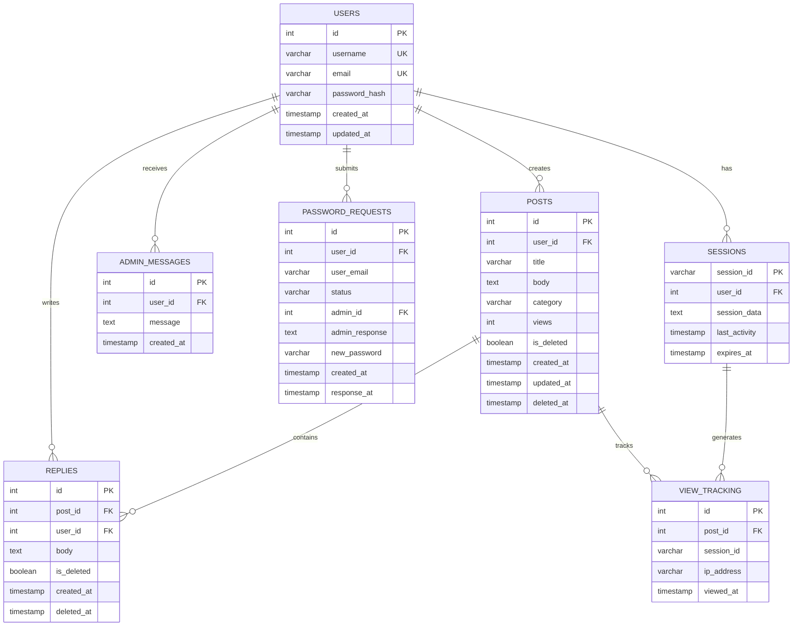

# Database Schema - TechForum

## Overview
This document provides a comprehensive overview of the TechForum database schema, including table structures, relationships, and data flow patterns.

## 🎯 Purpose
- Define database structure and relationships
- Document table schemas and constraints
- Explain data integrity and security measures
- Guide database implementation and maintenance

---

## 📊 Entity Relationship Diagram



---

## 📋 Table Specifications

### 🧑 USERS Table

**Purpose:** Stores user account information and authentication data

| Column | Type | Constraints | Description |
|--------|------|-------------|-------------|
| id | INT | PRIMARY KEY, AUTO_INCREMENT | Unique user identifier |
| username | VARCHAR(50) | UNIQUE, NOT NULL | User's display name |
| email | VARCHAR(120) | UNIQUE, NOT NULL | User's email address |
| password_hash | VARCHAR(255) | NOT NULL | Hashed password using PHP password_hash() |
| created_at | TIMESTAMP | DEFAULT CURRENT_TIMESTAMP | Account creation time |
| updated_at | TIMESTAMP | DEFAULT CURRENT_TIMESTAMP ON UPDATE | Last profile update |

**Indexes:**
- Primary: id
- Unique: username, email
- Index: created_at (for user registration analytics)

**Business Rules:**
- Username must be 3-20 characters, alphanumeric with underscore/dash
- Email must be valid format and globally unique
- Passwords are hashed using PHP's password_hash() with default algorithm
- Soft delete is not implemented (account deactivation handled by admin flags)

```sql
CREATE TABLE users (
    id INT AUTO_INCREMENT PRIMARY KEY,
    username VARCHAR(50) UNIQUE NOT NULL,
    email VARCHAR(120) UNIQUE NOT NULL,
    password_hash VARCHAR(255) NOT NULL,
    created_at TIMESTAMP DEFAULT CURRENT_TIMESTAMP,
    updated_at TIMESTAMP DEFAULT CURRENT_TIMESTAMP ON UPDATE CURRENT_TIMESTAMP,
    
    INDEX idx_created_at (created_at),
    CONSTRAINT chk_username_length CHECK (CHAR_LENGTH(username) >= 3),
    CONSTRAINT chk_username_format CHECK (username REGEXP '^[a-zA-Z0-9_-]+$')
);
```

---

### 📝 POSTS Table

**Purpose:** Stores forum posts with metadata and content

| Column | Type | Constraints | Description |
|--------|------|-------------|-------------|
| id | INT | PRIMARY KEY, AUTO_INCREMENT | Unique post identifier |
| user_id | INT | FOREIGN KEY, NOT NULL | Reference to post author |
| title | VARCHAR(255) | NOT NULL | Post title |
| body | TEXT | NOT NULL | Post content |
| category | VARCHAR(50) | NOT NULL, DEFAULT 'Soft Skills' | Post category |
| views | INT | DEFAULT 0 | View count |
| is_deleted | BOOLEAN | DEFAULT FALSE | Soft delete flag |
| created_at | TIMESTAMP | DEFAULT CURRENT_TIMESTAMP | Post creation time |
| updated_at | TIMESTAMP | DEFAULT CURRENT_TIMESTAMP ON UPDATE | Last edit time |
| deleted_at | TIMESTAMP | NULL | Deletion timestamp |

**Indexes:**
- Primary: id
- Foreign Key: user_id → users(id)
- Index: category, created_at, is_deleted
- Composite: (is_deleted, created_at) for active post listings

**Business Rules:**
- Title and body are required and cannot be empty
- Category must be one of: 'Soft Skills', 'Technology', 'Academics', 'Sports', 'Lifestyle'
- View counter is throttled per session to prevent spam
- Soft delete preserves data for admin review
- Updated timestamp changes only on content modification

```sql
CREATE TABLE posts (
    id INT AUTO_INCREMENT PRIMARY KEY,
    user_id INT NOT NULL,
    title VARCHAR(255) NOT NULL,
    body TEXT NOT NULL,
    category VARCHAR(50) NOT NULL DEFAULT 'Soft Skills',
    views INT DEFAULT 0,
    is_deleted BOOLEAN DEFAULT FALSE,
    created_at TIMESTAMP DEFAULT CURRENT_TIMESTAMP,
    updated_at TIMESTAMP DEFAULT CURRENT_TIMESTAMP ON UPDATE CURRENT_TIMESTAMP,
    deleted_at TIMESTAMP NULL,
    
    FOREIGN KEY (user_id) REFERENCES users(id) ON DELETE CASCADE,
    INDEX idx_category (category),
    INDEX idx_created_at (created_at),
    INDEX idx_active_posts (is_deleted, created_at),
    INDEX idx_views (views),
    
    CONSTRAINT chk_title_not_empty CHECK (CHAR_LENGTH(TRIM(title)) > 0),
    CONSTRAINT chk_body_not_empty CHECK (CHAR_LENGTH(TRIM(body)) > 0),
    CONSTRAINT chk_valid_category CHECK (category IN ('Soft Skills', 'Technology', 'Academics', 'Sports', 'Lifestyle'))
);
```

**Note:** The system supports dynamic schema detection for `user_id` vs `author_id` columns for backward compatibility.

---

### 💬 REPLIES Table

**Purpose:** Stores threaded replies to forum posts

| Column | Type | Constraints | Description |
|--------|------|-------------|-------------|
| id | INT | PRIMARY KEY, AUTO_INCREMENT | Unique reply identifier |
| post_id | INT | FOREIGN KEY, NOT NULL | Reference to parent post |
| user_id | INT | FOREIGN KEY, NOT NULL | Reference to reply author |
| body | TEXT | NOT NULL | Reply content |
| is_deleted | BOOLEAN | DEFAULT FALSE | Soft delete flag |
| created_at | TIMESTAMP | DEFAULT CURRENT_TIMESTAMP | Reply creation time |
| deleted_at | TIMESTAMP | NULL | Deletion timestamp |

**Indexes:**
- Primary: id
- Foreign Keys: post_id → posts(id), user_id → users(id)
- Composite: (post_id, is_deleted, created_at) for reply threads

**Business Rules:**
- Reply body cannot be empty
- Replies are displayed in chronological order
- Soft delete preserves reply context
- Cascade delete when parent post is permanently deleted

```sql
CREATE TABLE replies (
    id INT AUTO_INCREMENT PRIMARY KEY,
    post_id INT NOT NULL,
    user_id INT NOT NULL,
    body TEXT NOT NULL,
    is_deleted BOOLEAN DEFAULT FALSE,
    created_at TIMESTAMP DEFAULT CURRENT_TIMESTAMP,
    deleted_at TIMESTAMP NULL,
    
    FOREIGN KEY (post_id) REFERENCES posts(id) ON DELETE CASCADE,
    FOREIGN KEY (user_id) REFERENCES users(id) ON DELETE CASCADE,
    INDEX idx_post_replies (post_id, is_deleted, created_at),
    
    CONSTRAINT chk_body_not_empty CHECK (CHAR_LENGTH(TRIM(body)) > 0)
);
```

---

### 💌 ADMIN_MESSAGES Table

**Purpose:** Stores administrative messages to users

| Column | Type | Constraints | Description |
|--------|------|-------------|-------------|
| id | INT | PRIMARY KEY, AUTO_INCREMENT | Unique message identifier |
| user_id | INT | FOREIGN KEY, NOT NULL | Message recipient |
| message | TEXT | NOT NULL | Message content |
| created_at | TIMESTAMP | DEFAULT CURRENT_TIMESTAMP | Message timestamp |

**Indexes:**
- Primary: id
- Foreign Key: user_id → users(id)
- Index: created_at for message history

**Business Rules:**
- Messages are one-way communication from admin to user
- Message content cannot be empty
- Messages are retained for audit purposes
- No user replies to admin messages

```sql
CREATE TABLE admin_messages (
    id INT AUTO_INCREMENT PRIMARY KEY,
    user_id INT NOT NULL,
    message TEXT NOT NULL,
    created_at TIMESTAMP DEFAULT CURRENT_TIMESTAMP,
    
    FOREIGN KEY (user_id) REFERENCES users(id) ON DELETE CASCADE,
    INDEX idx_user_messages (user_id, created_at),
    
    CONSTRAINT chk_message_not_empty CHECK (CHAR_LENGTH(TRIM(message)) > 0)
);
```

---

### 🔄 PASSWORD_REQUESTS Table

**Purpose:** Manages password reset workflow with admin approval

| Column | Type | Constraints | Description |
|--------|------|-------------|-------------|
| id | INT | PRIMARY KEY, AUTO_INCREMENT | Unique request identifier |
| user_id | INT | FOREIGN KEY, NOT NULL | User requesting reset |
| user_email | VARCHAR(120) | NOT NULL | Email for verification |
| status | VARCHAR(20) | DEFAULT 'pending' | Request status |
| admin_id | INT | NULL | Admin who processed request |
| admin_response | TEXT | NULL | Admin's response/reason |
| new_password | VARCHAR(255) | NULL | Generated temporary password |
| created_at | TIMESTAMP | DEFAULT CURRENT_TIMESTAMP | Request creation time |
| response_at | TIMESTAMP | NULL | Admin response time |

**Indexes:**
- Primary: id
- Foreign Key: user_id → users(id)
- Index: status, created_at

**Business Rules:**
- Status values: 'pending', 'approved', 'rejected'
- Admin approval required for all password resets
- Temporary passwords are single-use
- Request history is maintained for audit

```sql
CREATE TABLE password_requests (
    id INT AUTO_INCREMENT PRIMARY KEY,
    user_id INT NOT NULL,
    user_email VARCHAR(120) NOT NULL,
    status VARCHAR(20) DEFAULT 'pending',
    admin_id INT NULL,
    admin_response TEXT NULL,
    new_password VARCHAR(255) NULL,
    created_at TIMESTAMP DEFAULT CURRENT_TIMESTAMP,
    response_at TIMESTAMP NULL,
    
    FOREIGN KEY (user_id) REFERENCES users(id) ON DELETE CASCADE,
    INDEX idx_status (status),
    INDEX idx_created_at (created_at),
    
    CONSTRAINT chk_valid_status CHECK (status IN ('pending', 'approved', 'rejected'))
);
```

---

### 🔐 SESSIONS Table

**Purpose:** Manages user sessions and authentication state

| Column | Type | Constraints | Description |
|--------|------|-------------|-------------|
| session_id | VARCHAR(128) | PRIMARY KEY | PHP session identifier |
| user_id | INT | FOREIGN KEY, NULL | Associated user (if logged in) |
| session_data | TEXT | NULL | Serialized session data |
| last_activity | TIMESTAMP | DEFAULT CURRENT_TIMESTAMP | Last session activity |
| expires_at | TIMESTAMP | NOT NULL | Session expiration time |

**Indexes:**
- Primary: session_id
- Foreign Key: user_id → users(id)
- Index: last_activity, expires_at

**Business Rules:**
- Sessions expire after 24 hours of inactivity
- Guest sessions (user_id = NULL) track anonymous activity
- Session cleanup removes expired sessions automatically
- View tracking uses session throttling

```sql
CREATE TABLE sessions (
    session_id VARCHAR(128) PRIMARY KEY,
    user_id INT NULL,
    session_data TEXT NULL,
    last_activity TIMESTAMP DEFAULT CURRENT_TIMESTAMP ON UPDATE CURRENT_TIMESTAMP,
    expires_at TIMESTAMP NOT NULL,
    
    FOREIGN KEY (user_id) REFERENCES users(id) ON DELETE CASCADE,
    INDEX idx_last_activity (last_activity),
    INDEX idx_expires_at (expires_at),
    INDEX idx_user_sessions (user_id)
);
```

---

### 👁️ VIEW_TRACKING Table

**Purpose:** Tracks post views while preventing spam inflation

| Column | Type | Constraints | Description |
|--------|------|-------------|-------------|
| id | INT | PRIMARY KEY, AUTO_INCREMENT | Unique tracking record |
| post_id | INT | FOREIGN KEY, NOT NULL | Post being viewed |
| session_id | VARCHAR(128) | NOT NULL | Session identifier |
| ip_address | VARCHAR(45) | NULL | Client IP address |
| viewed_at | TIMESTAMP | DEFAULT CURRENT_TIMESTAMP | View timestamp |

**Indexes:**
- Primary: id
- Foreign Key: post_id → posts(id)
- Composite: (post_id, session_id) for duplicate detection
- Index: viewed_at for analytics

**Business Rules:**
- One view increment per session per post
- Anonymous and authenticated views are tracked
- IP addresses stored for analytics (respecting privacy)
- View data used for content popularity metrics

```sql
CREATE TABLE view_tracking (
    id INT AUTO_INCREMENT PRIMARY KEY,
    post_id INT NOT NULL,
    session_id VARCHAR(128) NOT NULL,
    ip_address VARCHAR(45) NULL,
    viewed_at TIMESTAMP DEFAULT CURRENT_TIMESTAMP,
    
    FOREIGN KEY (post_id) REFERENCES posts(id) ON DELETE CASCADE,
    UNIQUE KEY uk_post_session (post_id, session_id),
    INDEX idx_viewed_at (viewed_at)
);
```

---

## 🔗 Relationships and Data Flow

### Primary Relationships
1. **Users → Posts (1:N):** One user can create multiple posts
2. **Users → Replies (1:N):** One user can write multiple replies
3. **Posts → Replies (1:N):** One post can have multiple replies
4. **Users → Admin Messages (1:N):** One user can receive multiple admin messages
5. **Users → Password Requests (1:N):** One user can submit multiple reset requests
6. **Users → Sessions (1:N):** One user can have multiple active sessions

### Data Integrity Constraints
- **Referential Integrity:** All foreign keys maintain referential integrity
- **Cascade Deletes:** User deletion cascades to associated content
- **Check Constraints:** Data validation at database level
- **Unique Constraints:** Prevent duplicate usernames and emails

### Performance Optimizations
- **Strategic Indexing:** Indexes on frequently queried columns
- **Composite Indexes:** Multi-column indexes for complex queries
- **Query Optimization:** Database queries optimized for common access patterns
- **Connection Pooling:** Efficient database connection management

---

## 🛡️ Security Measures

### Data Protection
- **Password Security:** Passwords hashed using PHP password_hash()
- **SQL Injection Prevention:** Prepared statements for all queries
- **Input Validation:** Database constraints validate data integrity
- **Access Control:** User permissions enforced at application and database level

### Privacy Considerations
- **Data Minimization:** Only necessary data is collected and stored
- **Retention Policies:** Old data is archived or purged according to policies
- **Anonymous Tracking:** View tracking respects user privacy
- **Audit Trails:** Administrative actions are logged for accountability

### Backup and Recovery
- **Regular Backups:** Automated database backups
- **Point-in-time Recovery:** Transaction log backups enable precise recovery
- **Disaster Recovery:** Backup verification and recovery testing
- **Data Archival:** Long-term storage of historical data

---

## 📈 Analytics and Reporting

### Performance Metrics
- **Query Performance:** Monitoring slow queries and optimization
- **Index Usage:** Tracking index effectiveness
- **Storage Growth:** Monitoring database size and growth patterns
- **Connection Metrics:** Database connection pool monitoring

### Business Intelligence
- **User Analytics:** Registration trends, engagement patterns
- **Content Analytics:** Post popularity, category performance
- **Community Health:** User activity, content quality metrics
- **Administrative Reports:** System usage, moderation activities

---

## 🔧 Migration and Schema Evolution

### Schema Versioning
- **Migration Scripts:** Versioned database schema changes
- **Backward Compatibility:** Support for existing data during upgrades
- **Rollback Procedures:** Safe rollback of schema changes
- **Testing Protocols:** Schema change testing procedures

### Dynamic Schema Support
- **Column Detection:** Runtime detection of user_id vs author_id columns
- **Feature Flags:** Database-driven feature enablement
- **Schema Adaptation:** Graceful handling of schema variations
- **Migration Tools:** Automated tools for schema updates (migrate_posts.php, migrate_add_views.php)

---
*This database schema provides a robust foundation for the TechForum platform while maintaining flexibility for future enhancements.*