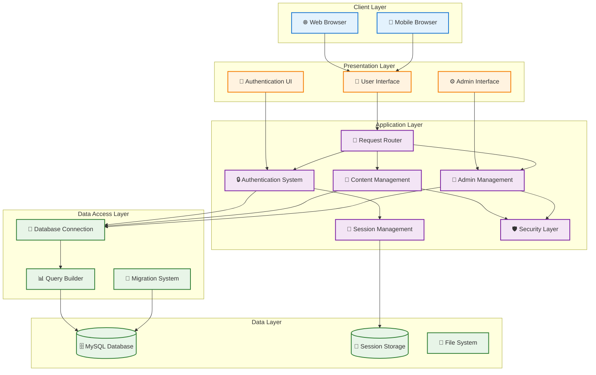
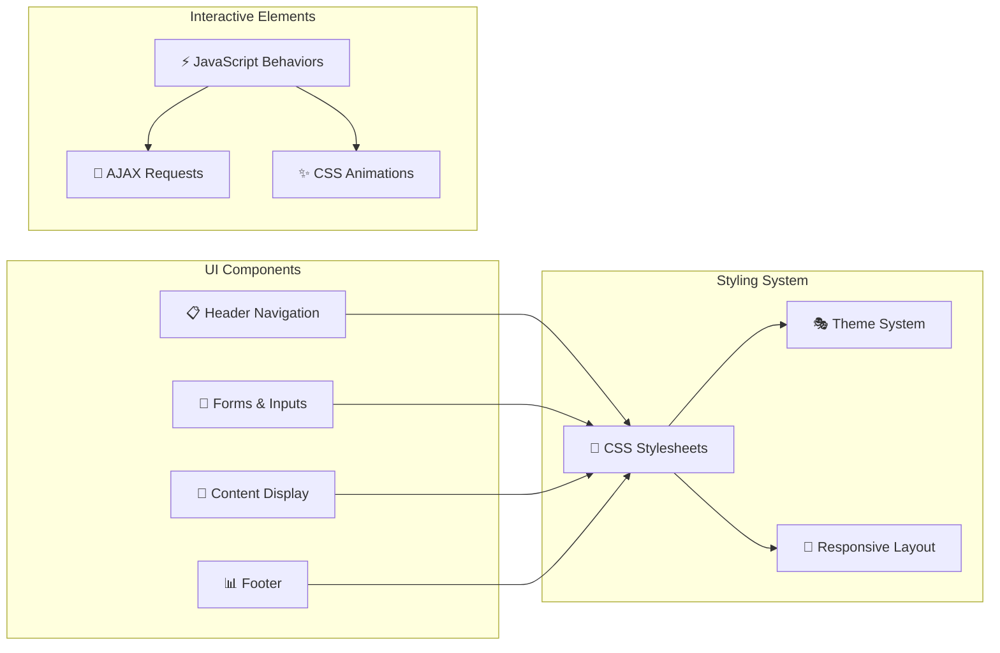
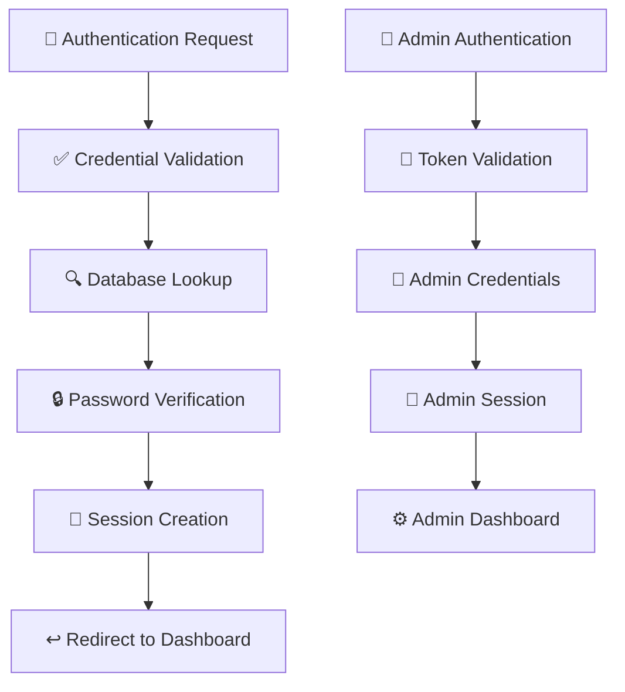
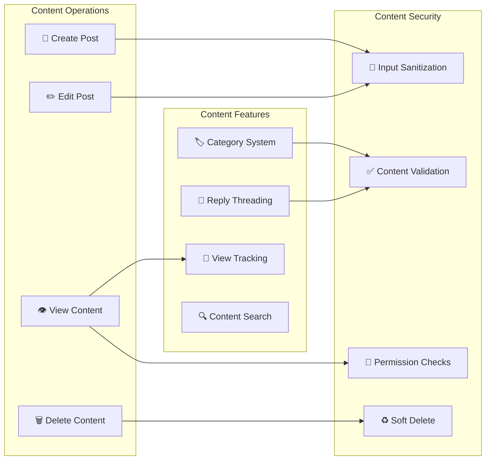
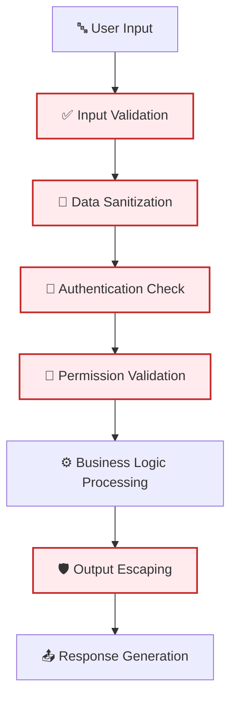

# System Components - TechForum

## Overview
This document provides a comprehensive overview of the TechForum system architecture, including component organization, technology stack, and integration patterns.

## 🎯 Purpose
- Define system architecture and component relationships
- Document technology choices and implementation patterns
- Guide development and maintenance practices
- Support system scalability and evolution

---

## 🏗️ Architecture Overview



---

## 📋 Technology Stack

### Frontend Technologies
- **HTML5:** Semantic markup and modern web standards
- **CSS3:** Advanced styling with gradients, animations, and responsive design
- **JavaScript (ES6+):** Interactive behaviors and AJAX functionality
- **Responsive Design:** Mobile-first approach with CSS media queries

### Backend Technologies
- **PHP 7.4+:** Server-side programming language
- **MySQL 5.7+:** Relational database management system
- **Apache/Nginx:** Web server with mod_rewrite support
- **Session Management:** PHP native sessions with database storage

### Development Tools
- **Git:** Version control and collaboration
- **Composer:** PHP dependency management (future enhancement)
- **Database Migrations:** Custom migration scripts for schema management
- **Debug Tools:** Built-in debugging and profiling capabilities

---

## 🧩 Component Breakdown

### 🎨 Presentation Layer Components

#### User Interface (UI)


**Key Files:**
- `assets/css/style.css` - Main stylesheet
- `assets/css/dashboard.css` - Dashboard-specific styles
- `assets/css/profile.css` - Profile page styles
- `assets/js/auth.js` - Authentication interactions
- `assets/js/dashboard.js` - Dashboard functionality

**Responsibilities:**
- User interface rendering and interaction
- Form validation and submission
- Responsive design adaptation
- Visual feedback and animations

#### Authentication Interface
**Components:**
- Dual-mode login/registration forms
- Animated form transitions
- Password reset workflow
- Admin access portal

**Features:**
- Visual form validation
- Smooth transitions between login/signup
- Mobile-responsive design
- Security-focused UX

#### Admin Interface
**Components:**
- Admin dashboard with system overview
- User management interface
- Content moderation tools
- System reports and analytics

**Security Features:**
- Two-layer authentication UI
- Role-based interface elements
- Audit trail visualization
- Secure action confirmations

---

### 🔧 Application Layer Components

#### Request Router
```php
// Simplified routing logic
function route_request($uri) {
    switch($uri) {
        case '/':
        case '/index.php':
            return 'home_controller';
        case '/auth.php':
            return 'auth_controller';
        case '/posts.php':
            return 'posts_controller';
        case '/admin_dashboard.php':
            return 'admin_controller';
        default:
            return 'not_found_controller';
    }
}
```

**Responsibilities:**
- URL routing and request dispatch
- Parameter extraction and validation
- Controller instantiation
- Response coordination

#### Authentication System


**Core Functions:**
- User registration and login
- Password hashing and verification
- Session management
- Two-layer admin authentication
- Password reset workflow

**Security Features:**
- Secure password hashing (PHP password_hash())
- Session-based authentication
- CSRF protection (planned enhancement)
- Rate limiting (planned enhancement)

#### Content Management System


**Key Features:**
- CRUD operations for posts and replies
- Category-based organization
- Soft delete functionality
- View counting with session throttling
- Ownership validation
- Content sanitization

#### Admin Management System
**Components:**
- User account management
- Content moderation
- Password reset approval
- System monitoring
- Admin messaging

**Security Layers:**
- Token-based access gate
- Fixed admin credentials
- Action logging and audit trails
- Permission-based operations

#### Session Management
**Functionality:**
- PHP session handling
- User state persistence
- Anonymous session tracking
- Session timeout management
- Cross-request data storage

---

### 💾 Data Access Layer Components

#### Database Connection Manager
```php
class DatabaseConnection {
    private static $pdo = null;
    
    public static function getConnection() {
        if (self::$pdo === null) {
            $dsn = "mysql:host=" . DB_HOST . ";dbname=" . DB_NAME;
            self::$pdo = new PDO($dsn, DB_USER, DB_PASS, [
                PDO::ATTR_ERRMODE => PDO::ERRMODE_EXCEPTION,
                PDO::ATTR_DEFAULT_FETCH_MODE => PDO::FETCH_ASSOC,
                PDO::ATTR_EMULATE_PREPARES => false
            ]);
        }
        return self::$pdo;
    }
}
```

**Features:**
- Singleton PDO connection
- Connection pooling (basic)
- Error handling and logging
- Prepared statement support

#### Query Builder and ORM (Lightweight)
**Dynamic Schema Support:**
```php
function detect_user_column($pdo) {
    try {
        $pdo->query('SELECT user_id FROM posts LIMIT 1');
        return 'user_id';
    } catch (PDOException $e) {
        return 'author_id';
    }
}
```

**Features:**
- Dynamic schema detection
- Prepared statement wrappers
- Basic query building
- Migration support

#### Migration System
**Migration Files:**
- `migrate_posts.php` - Schema migration tool
- `migrate_add_views.php` - Add view tracking column

**Functionality:**
- Schema version management
- Data migration scripts
- Rollback capabilities
- Development-production parity

---

## 🔒 Security Architecture

### Security Layers


### Security Components

#### Input Validation and Sanitization
```php
function h($string) {
    return htmlspecialchars($string, ENT_QUOTES, 'UTF-8');
}

function sanitize_category($category) {
    $valid_categories = get_categories();
    return in_array($category, $valid_categories) ? $category : $valid_categories[0];
}
```

#### Authentication and Authorization
- Session-based user authentication
- Two-layer admin authentication
- Permission checks for content operations
- Role-based access control

#### Data Protection
- Prepared statements for SQL injection prevention
- Output escaping for XSS prevention
- Password hashing with secure algorithms
- Session security measures

---

## 📁 File Organization

### Directory Structure
```
/PROJECT-1/
├── 📄 index.php                 # Homepage
├── 🔐 auth.php                  # Authentication portal
├── 📝 posts.php                 # Post listings and management
├── 👤 profile.php               # User profile management
├── ⚙️ admin_dashboard.php       # Admin interface
├── 🔧 init.php                  # Bootstrap and initialization
├── 📁 assets/                   # Static resources
│   ├── 🎨 css/                  # Stylesheets
│   ├── ⚡ js/                   # JavaScript files
│   └── 🖼️ images/              # Image assets
├── 📁 config/                   # Configuration files
│   ├── ⚙️ config.php            # Application configuration
│   └── 🗄️ db.php               # Database configuration
├── 📁 includes/                 # Shared includes
│   ├── 🔧 functions.php         # Utility functions
│   ├── 📋 header.php            # Common header
│   └── 📊 footer.php            # Common footer
├── 📁 auth/                     # Authentication handlers
│   ├── 🔑 login.php             # Login processing
│   └── 📝 register.php          # Registration processing
└── 📁 docs/                     # Documentation
    ├── 🔄 dfd/                  # Data Flow Diagrams
    ├── 👥 use-cases/            # Use Case Documentation
    └── 🏗️ architecture/         # Architecture Documentation
```

### Component Organization

#### Core Application Files
- **Entry Points:** Main PHP files that handle specific functionality
- **Configuration:** Centralized configuration management
- **Includes:** Shared functionality and common elements
- **Assets:** Frontend resources organized by type

#### Modular Structure
- **Authentication Module:** Login, registration, and session management
- **Content Module:** Post and reply management
- **Admin Module:** Administrative functionality
- **User Module:** Profile and user management

---

## 🚀 Performance Architecture

### Performance Strategies
```mermaid
graph LR
    subgraph "Frontend Performance"
        MINIFY[📦 Asset Minification]
        CACHE[💾 Browser Caching]
        RESPONSIVE[📱 Responsive Images]
    end
    
    subgraph "Backend Performance"
        DB_OPT[🗄️ Database Optimization]
        QUERY_CACHE[🔄 Query Caching]
        SESSION_OPT[🔑 Session Optimization]
    end
    
    subgraph "Infrastructure"
        CDN[🌐 CDN (Future)]
        LOAD_BALANCE[⚖️ Load Balancing (Future)]
        CACHING[💨 Server Caching]
    end
```

### Optimization Techniques
- **Database Indexing:** Strategic indexes for common queries
- **Query Optimization:** Efficient SQL queries and prepared statements
- **Asset Optimization:** Minified CSS/JS and optimized images
- **Caching Strategy:** Browser caching and server-side caching
- **Session Management:** Efficient session storage and cleanup

---

## 🔧 Development and Deployment

### Development Workflow
```mermaid
graph TD
    DEV[👨‍💻 Development] --> TEST[🧪 Testing]
    TEST --> STAGE[🎭 Staging]
    STAGE --> PROD[🚀 Production]
    
    DEV --> GIT[📂 Git Repository]
    GIT --> CI[🔄 Continuous Integration (Future)]
    CI --> DEPLOY[🚀 Automated Deployment (Future)]
```

### Environment Configuration
- **Development:** Local XAMPP/WAMP/LAMP stack
- **Staging:** Production-like environment for testing
- **Production:** Live server with optimized configuration

### Deployment Strategy
- **Manual Deployment:** Current file-based deployment
- **Database Migrations:** Version-controlled schema changes
- **Configuration Management:** Environment-specific settings
- **Backup and Recovery:** Automated backup procedures

---

## 📈 Scalability Considerations

### Horizontal Scaling
- **Database Replication:** Master-slave replication for read scaling
- **Load Balancing:** Multiple application servers
- **Session Storage:** External session storage (Redis/Memcached)
- **File Storage:** Distributed file systems or cloud storage

### Vertical Scaling
- **Server Resources:** CPU, memory, and storage upgrades
- **Database Optimization:** Query optimization and indexing
- **Application Optimization:** Code profiling and optimization
- **Caching Layers:** Multiple levels of caching

### Future Enhancements
- **API Development:** RESTful API for mobile apps
- **Real-time Features:** WebSocket integration for live updates
- **Search Engine:** Full-text search with Elasticsearch
- **Content Delivery:** CDN integration for global performance

---

## 🛠️ Maintenance and Monitoring

### System Health Monitoring
- **Error Logging:** Comprehensive error tracking
- **Performance Metrics:** Response time and resource monitoring
- **Security Auditing:** Regular security assessments
- **Database Monitoring:** Query performance and storage growth

### Maintenance Procedures
- **Regular Backups:** Automated backup scheduling
- **Security Updates:** System and application updates
- **Performance Tuning:** Ongoing optimization efforts
- **Documentation Updates:** Keeping documentation current

---
*This system architecture provides a solid foundation for TechForum while maintaining flexibility for future growth and enhancement.*