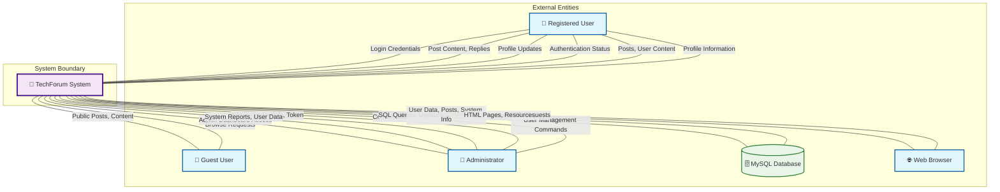

# Context Diagram (Level 0 DFD) - TechForum

## Overview
The Context Diagram shows the TechForum system as a single process with its external entities and the data flows between them.

## 🎯 Purpose
- Define system boundaries
- Identify external entities that interact with the system
- Show high-level data flows

## 📊 Context Diagram

## 🔄 External Entities & Data Flows

### 👤 Registered User
**Incoming Data:**
- Login credentials (email, password)
- Post content (title, body, category)
- Reply content
- Profile updates (username, email changes)
- Password reset requests

**Outgoing Data:**
- Authentication status (success/failure)
- Personal posts and content
- Profile information
- Dashboard content
- System notifications

### 👥 Guest User
**Incoming Data:**
- Browse requests
- Public page requests

**Outgoing Data:**
- Public posts and content
- Authentication portal
- System information

### 🔐 Administrator
**Incoming Data:**
- Admin credentials
- Security tokens
- User management commands
- Content moderation actions
- System configuration changes

**Outgoing Data:**
- Admin dashboard access
- System reports
- User data and statistics
- Content management interface
- Password reset approvals

### 🗄️ MySQL Database
**Incoming Data:**
- SQL queries (SELECT, INSERT, UPDATE, DELETE)
- User registration data
- Post and reply content
- Session data
- View counters

**Outgoing Data:**
- User authentication data
- Posts and replies
- System configuration
- User profiles
- Admin logs

### 🌐 Web Browser
**Incoming Data:**
- HTTP requests
- Form submissions
- AJAX requests
- Resource requests (CSS, JS, images)

**Outgoing Data:**
- HTML pages
- CSS stylesheets
- JavaScript files
- JSON responses
- Static assets

## 🎨 System Boundary
The **TechForum System** boundary includes:
- All PHP application files
- Authentication system
- Content management system
- Admin panel
- Session management
- Security layers
- View tracking system

## 🔒 Security Considerations
- Two-layer admin authentication (token + credentials)
- Session-based user authentication
- Input sanitization and validation
- SQL injection prevention
- XSS protection through output escaping

## 📈 Key System Functions
1. **User Management**: Registration, authentication, profile management
2. **Content Management**: Posts, replies, categories, soft delete
3. **Administration**: User moderation, content oversight, system management
4. **Security**: Multi-layer authentication, input validation
5. **Analytics**: View tracking, engagement metrics

---
*This context diagram provides a high-level view of the TechForum system boundaries and external interactions.*