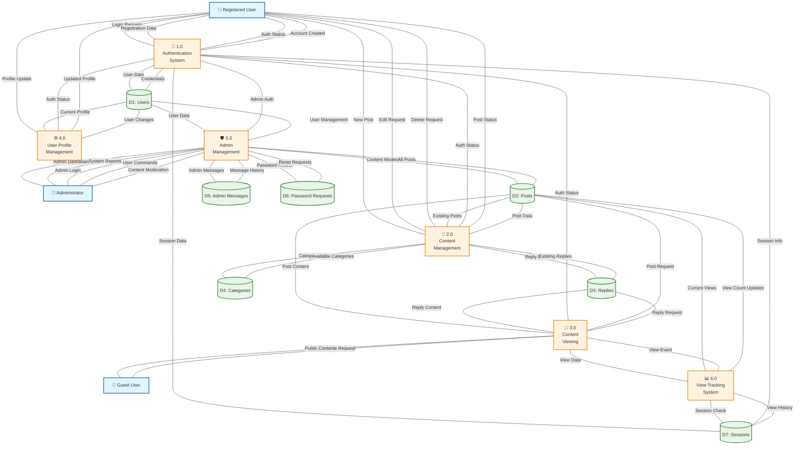

# Level 1 Data Flow Diagram - TechForum

## Overview
The Level 1 DFD breaks down the TechForum system into major processes, showing how data flows between processes and data stores.

## 🎯 Purpose
- Decompose the system into major functional processes
- Show data stores and their interactions
- Identify key data transformations

## 📊 Level 1 DFD

## 🔄 Process Descriptions

### 🔐 1.0 Authentication System
**Inputs:**
- Login credentials from users
- Registration data from new users
- Session validation requests

**Processes:**
- Validate login credentials
- Create new user accounts
- Manage user sessions
- Handle password resets

**Outputs:**
- Authentication status
- User session data
- Account creation confirmation

**Data Stores Used:**
- D1: Users (credential validation)
- D7: Sessions (session management)

### 📝 2.0 Content Management
**Inputs:**
- New post submissions
- Post edit requests
- Post deletion requests
- Reply submissions

**Processes:**
- Create new posts
- Update existing posts
- Soft delete posts/replies
- Validate ownership permissions
- Category assignment

**Outputs:**
- Post creation confirmation
- Edit/delete status
- Content validation results

**Data Stores Used:**
- D2: Posts (post CRUD operations)
- D3: Replies (reply management)
- D4: Categories (category assignment)

### 👀 3.0 Content Viewing
**Inputs:**
- Browse requests from users/guests
- Single post view requests
- Category filter requests

**Processes:**
- Retrieve post listings
- Display single post with replies
- Filter by category
- Format content for display
- Check visibility permissions

**Outputs:**
- Formatted post listings
- Individual post content
- Reply threads
- Public content for guests

**Data Stores Used:**
- D2: Posts (content retrieval)
- D3: Replies (reply retrieval)

### ⚙️ 4.0 User Profile Management
**Inputs:**
- Profile update requests
- Password change requests
- Account information requests

**Processes:**
- Update user profiles
- Change passwords
- Manage account settings
- Validate profile data

**Outputs:**
- Updated profile information
- Change confirmations
- Profile validation results

**Data Stores Used:**
- D1: Users (profile updates)

### 🛡️ 5.0 Admin Management
**Inputs:**
- Admin authentication requests
- User management commands
- Content moderation actions
- Password reset approvals

**Processes:**
- Two-layer admin authentication
- User account management
- Content moderation
- System administration
- Password reset processing

**Outputs:**
- Admin dashboard access
- System reports
- User management results
- Moderation confirmations

**Data Stores Used:**
- D1: Users (user management)
- D2: Posts (content moderation)
- D5: Admin Messages (admin communications)
- D6: Password Requests (reset processing)

### 📊 6.0 View Tracking System
**Inputs:**
- Post view events
- Session information
- View increment requests

**Processes:**
- Track post views
- Prevent view spam
- Update view counters
- Session-based throttling

**Outputs:**
- Updated view counts
- View tracking status

**Data Stores Used:**
- D2: Posts (view count updates)
- D7: Sessions (view throttling)

## 💾 Data Store Descriptions

### D1: Users
- **Contains:** User accounts, credentials, profile information
- **Structure:** id, username, email, password_hash, created_at
- **Access:** Authentication, Profile Management, Admin Management

### D2: Posts
- **Contains:** Forum posts with metadata
- **Structure:** id, user_id/author_id, title, body, category, views, is_deleted, timestamps
- **Access:** Content Management, Content Viewing, View Tracking, Admin Management

### D3: Replies
- **Contains:** Threaded replies to posts
- **Structure:** id, post_id, user_id, body, created_at, is_deleted
- **Access:** Content Management, Content Viewing

### D4: Categories
- **Contains:** Available post categories
- **Structure:** Predefined categories (Soft Skills, Technology, Academics, Sports, Lifestyle)
- **Access:** Content Management

### D5: Admin Messages
- **Contains:** Administrative communications
- **Structure:** id, user_id, message, created_at
- **Access:** Admin Management

### D6: Password Requests
- **Contains:** Password reset requests and status
- **Structure:** id, user_id, user_email, status, admin_response, timestamps
- **Access:** Admin Management

### D7: Sessions
- **Contains:** User session data and view tracking
- **Structure:** Session IDs, user associations, view history
- **Access:** Authentication, View Tracking

---
*This Level 1 DFD shows the major processes and data flows within the TechForum system.*