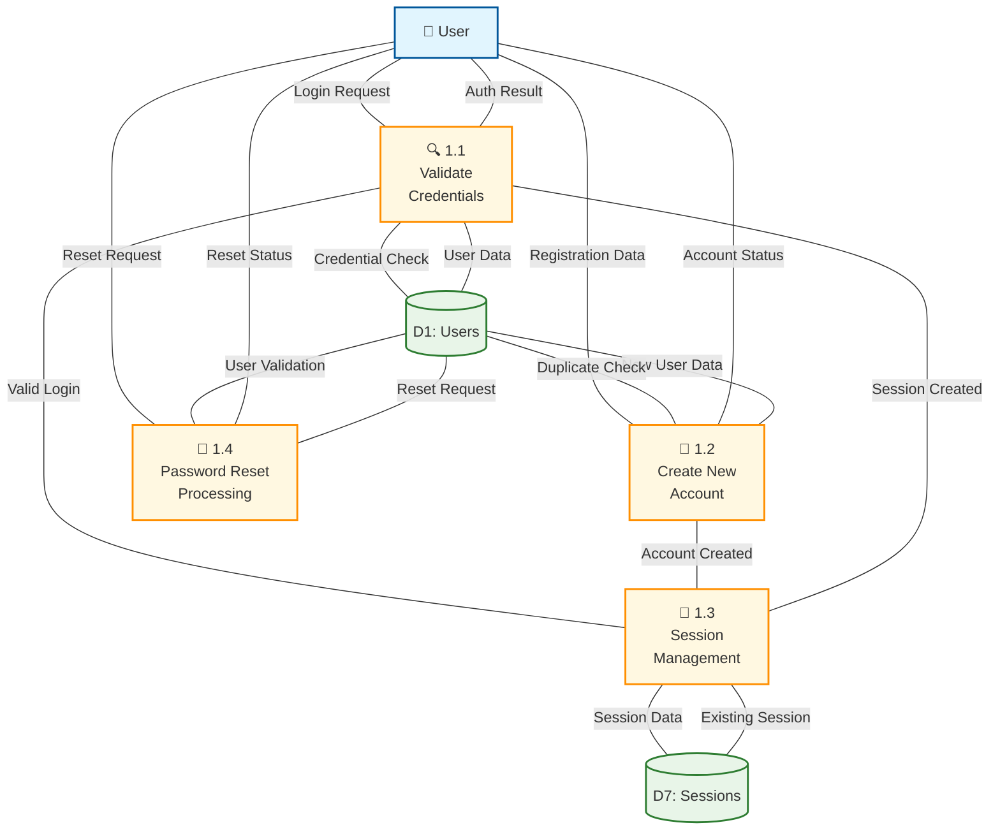
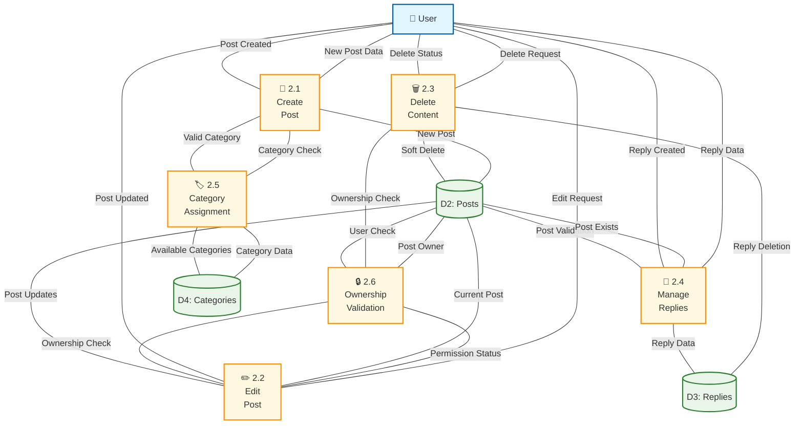
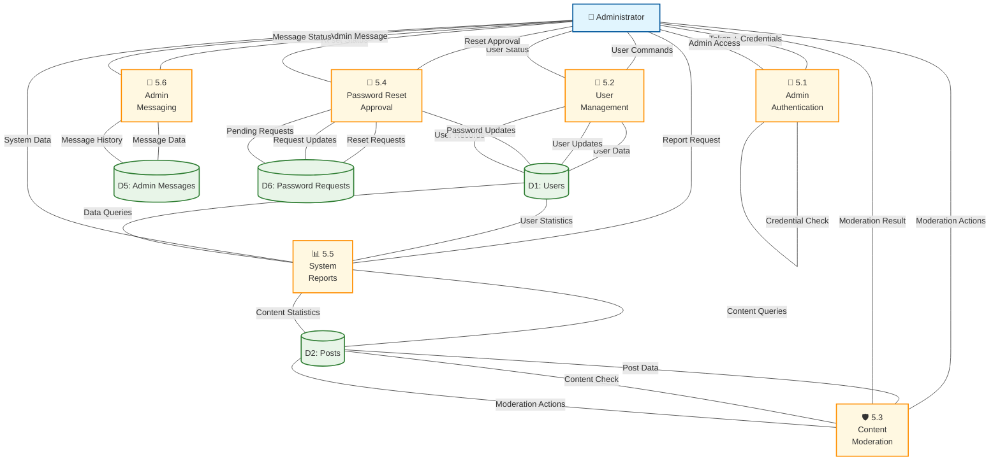

# Level 2 Data Flow Diagrams - TechForum

## Overview
Level 2 DFDs provide detailed breakdowns of complex processes from the Level 1 DFD, showing the internal sub-processes and data flows.

## 🎯 Purpose
- Decompose complex processes into detailed sub-processes
- Show internal data transformations
- Provide implementation-level detail

---

## 📊 Level 2 DFD: Authentication System (Process 1.0)

### 🔍 1.1 Validate Credentials
- Receives login credentials (email, password)
- Validates against stored user data
- Implements password hashing verification
- Returns authentication success/failure

### 👤 1.2 Create New Account
- Processes registration data
- Validates username/email uniqueness
- Hashes passwords securely
- Creates new user record

### 🔑 1.3 Session Management
- Creates user sessions on successful login
- Manages session data and timeouts
- Handles session validation for requests
- Implements logout functionality

### 🔄 1.4 Password Reset Processing
- Receives password reset requests
- Validates user existence
- Creates reset tokens/requests
- Coordinates with admin approval system

---

## 📊 Level 2 DFD: Content Management (Process 2.0)

### 📝 2.1 Create Post
- Validates post data (title, body, category)
- Assigns post to user
- Implements content sanitization
- Creates new post record

### ✏️ 2.2 Edit Post
- Validates ownership permissions
- Updates existing post content
- Maintains edit history
- Preserves post metadata

### 🗑️ 2.3 Delete Content
- Implements soft delete functionality
- Validates user permissions
- Marks posts/replies as deleted
- Preserves data for admin review

### 💬 2.4 Manage Replies
- Creates threaded replies to posts
- Validates parent post existence
- Implements reply permissions
- Manages reply hierarchy

### 🏷️ 2.5 Category Assignment
- Validates category selection
- Assigns posts to categories
- Implements category restrictions
- Manages category metadata

### 🔒 2.6 Ownership Validation
- Verifies user ownership of content
- Implements admin override permissions
- Validates edit/delete permissions
- Supports dynamic schema (user_id/author_id)

---

## 📊 Level 2 DFD: Admin Management (Process 5.0)

### 🔑 5.1 Admin Authentication
- Implements two-layer security (token + credentials)
- Validates admin tokens
- Verifies admin credentials
- Creates admin sessions

### 👥 5.2 User Management
- Manages user accounts
- Implements user activation/deactivation
- Handles user data updates
- Provides user search and filtering

### 🛡️ 5.3 Content Moderation
- Reviews reported content
- Implements content deletion/restoration
- Manages content flags
- Provides moderation logs

### 🔄 5.4 Password Reset Approval
- Reviews password reset requests
- Approves/rejects reset requests
- Generates temporary passwords
- Notifies users of reset status

### 📊 5.5 System Reports
- Generates user statistics
- Creates content analytics
- Provides system health reports
- Implements data export functionality

### 💬 5.6 Admin Messaging
- Creates admin messages to users
- Manages communication history
- Implements broadcast messaging
- Tracks message delivery status

---

## 🔗 Process Interactions

### Data Flow Coordination
- Authentication status flows to all content processes
- Ownership validation occurs before content modifications
- View tracking integrates with content viewing
- Admin processes have override permissions

### Error Handling
- Invalid credentials trigger error responses
- Permission violations are logged and reported
- Data validation failures provide user feedback
- System errors are captured for admin review

### Security Integration
- All processes validate user sessions
- Admin processes require elevated permissions
- Input sanitization occurs at process boundaries
- Output encoding prevents XSS attacks

---
*These Level 2 DFDs provide detailed implementation guidance for the TechForum system processes.*