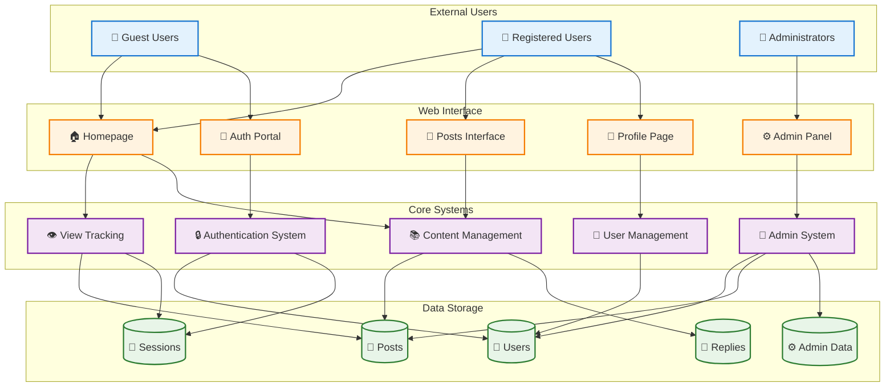
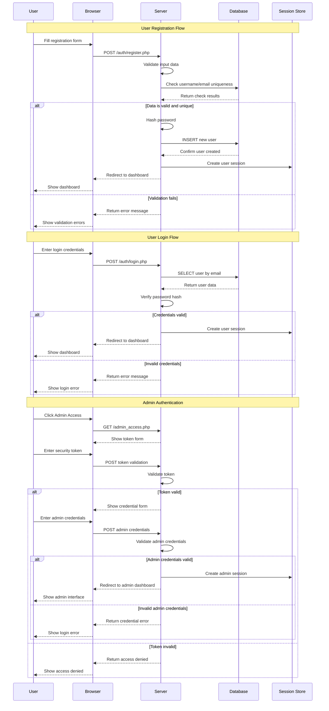
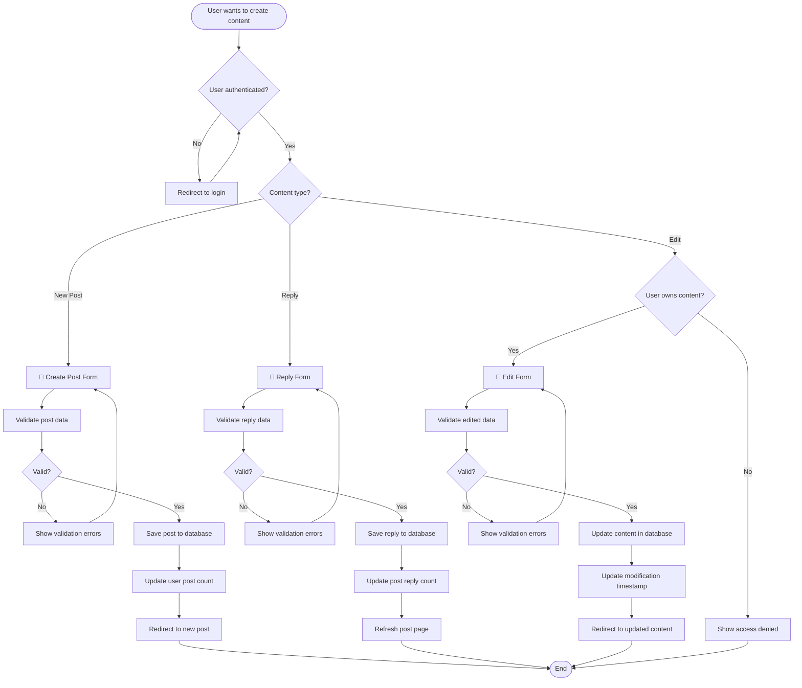
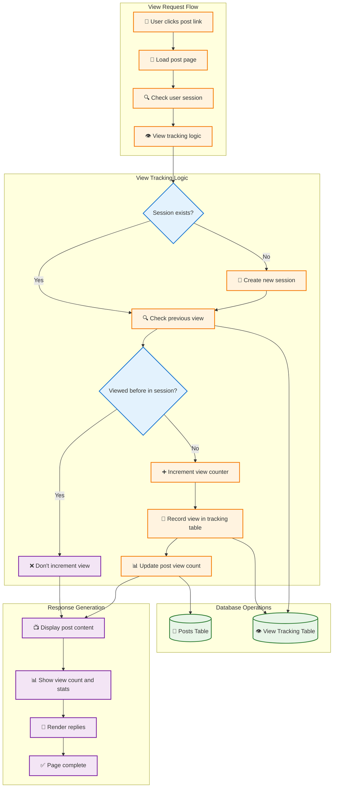
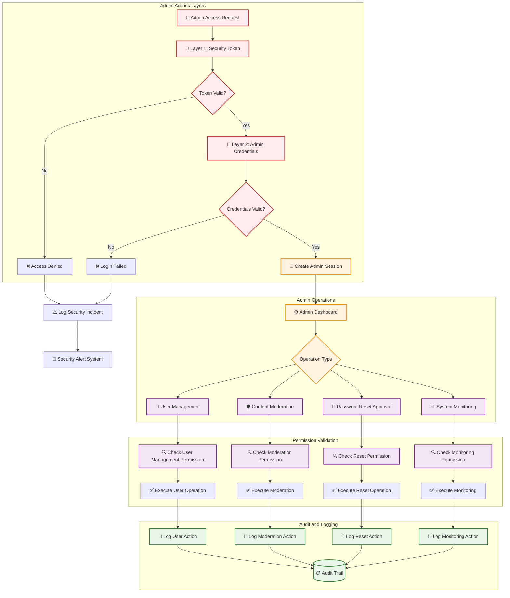
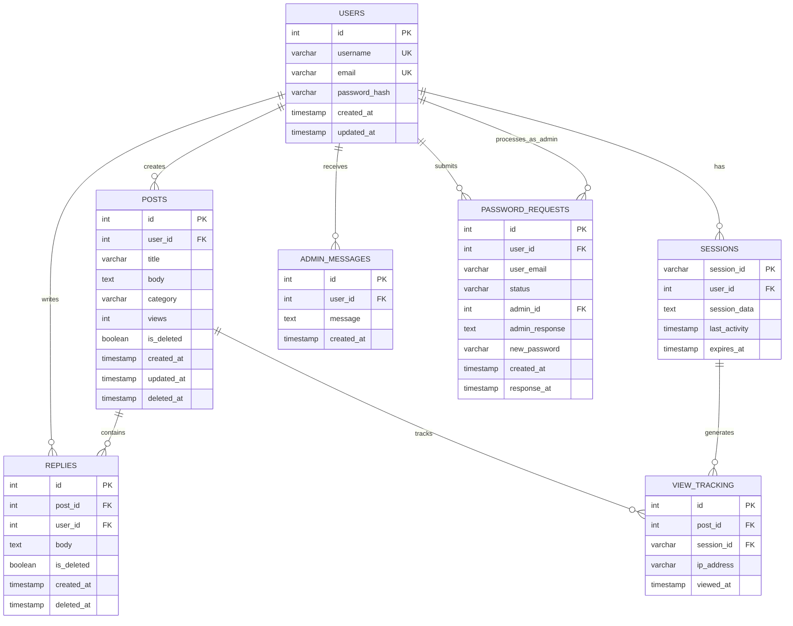
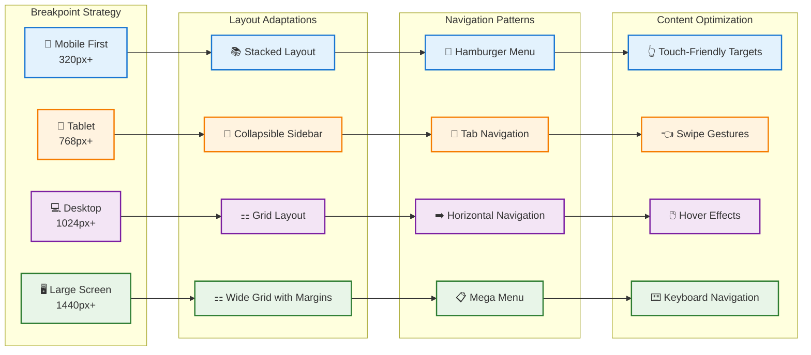
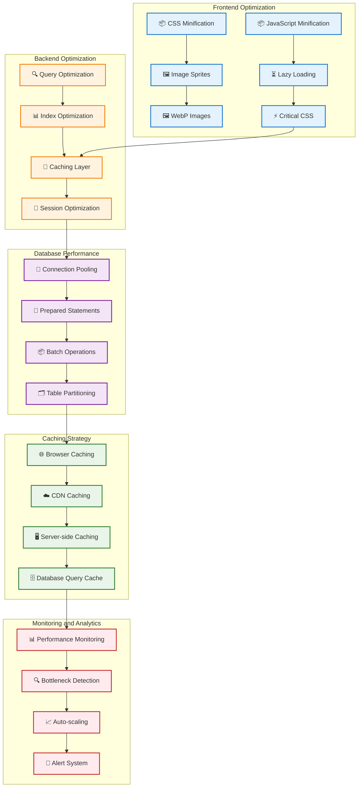

# Visual Diagrams - TechForum

## Overview
This document contains additional visual diagrams and flowcharts to complement the main documentation, providing alternative views and detailed process flows.

## 🎯 Purpose
- Provide comprehensive visual representations
- Support different learning styles
- Enhance understanding through multiple diagram types
- Serve as quick reference for developers

---

## 🔄 System Data Flow Overview

---

## 🔐 Authentication Flow Diagram

---

## 📝 Content Management Flow

---

## 👁️ View Tracking System

---

## 🛡️ Admin Security Architecture

---

## 🔄 Database Schema Relationships

---

## 🎨 User Interface Component Structure

```mermaid
graph TB
    subgraph "Layout Components"
        HEADER[📋 Header Component]
        MAIN[📄 Main Content Area]
        SIDEBAR[📊 Sidebar Component]
        FOOTER[📑 Footer Component]
    end
    
    subgraph "Header Elements"
        HEADER --> LOGO[🏠 Site Logo]
        HEADER --> NAV[🧭 Navigation Menu]
        HEADER --> USER_INFO[👤 User Info]
        HEADER --> AUTH_BUTTONS[🔐 Auth Buttons]
    end
    
    subgraph "Main Content Types"
        MAIN --> POST_LIST[📝 Post Listing]
        MAIN --> POST_DETAIL[📄 Post Detail]
        MAIN --> FORM_CONTAINER[📝 Form Container]
        MAIN --> DASHBOARD[⚙️ Dashboard]
        MAIN --> PROFILE[👤 Profile Page]
    end
    
    subgraph "Form Components"
        FORM_CONTAINER --> AUTH_FORM[🔐 Authentication Form]
        FORM_CONTAINER --> POST_FORM[📝 Post Creation Form]
        FORM_CONTAINER --> REPLY_FORM[💬 Reply Form]
        FORM_CONTAINER --> PROFILE_FORM[👤 Profile Edit Form]
    end
    
    subgraph "Interactive Elements"
        POST_LIST --> POST_CARD[📇 Post Card]
        POST_DETAIL --> REPLY_THREAD[💬 Reply Thread]
        POST_CARD --> VOTE_BUTTONS[👍 Vote Buttons]
        POST_CARD --> SHARE_BUTTONS[📤 Share Buttons]
        REPLY_THREAD --> REPLY_ITEM[💬 Reply Item]
    end
    
    subgraph "Sidebar Elements"
        SIDEBAR --> CATEGORIES[🏷️ Category Filter]
        SIDEBAR --> POPULAR_POSTS[🔥 Popular Posts]
        SIDEBAR --> USER_STATS[📊 User Statistics]
        SIDEBAR --> RECENT_ACTIVITY[⚡ Recent Activity]
    end
    
    classDef layout fill:#e3f2fd,stroke:#1976d2,stroke-width:2px
    classDef content fill:#fff3e0,stroke:#f57c00,stroke-width:2px
    classDef interactive fill:#f3e5f5,stroke:#7b1fa2,stroke-width:2px
    classDef sidebar fill:#e8f5e8,stroke:#2e7d32,stroke-width:2px
    
    class HEADER,MAIN,SIDEBAR,FOOTER layout
    class POST_LIST,POST_DETAIL,FORM_CONTAINER,DASHBOARD,PROFILE content
    class POST_CARD,REPLY_THREAD,VOTE_BUTTONS,SHARE_BUTTONS,REPLY_ITEM interactive
    class CATEGORIES,POPULAR_POSTS,USER_STATS,RECENT_ACTIVITY sidebar
```

---

## 📱 Mobile-First Responsive Design

---

## 🚀 Performance Optimization Strategy

---

*These visual diagrams provide comprehensive views of the TechForum system from multiple perspectives, supporting both technical implementation and system understanding.*