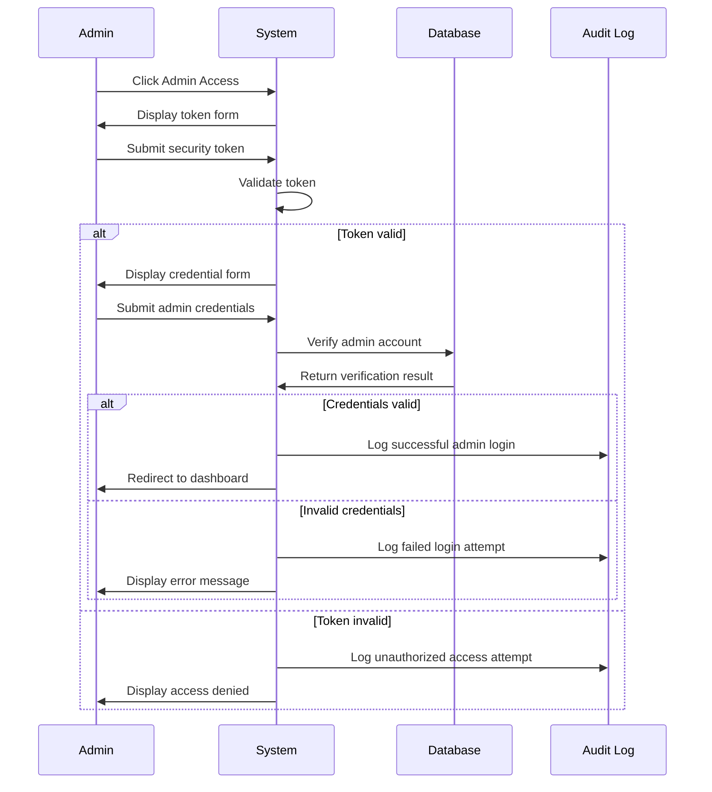
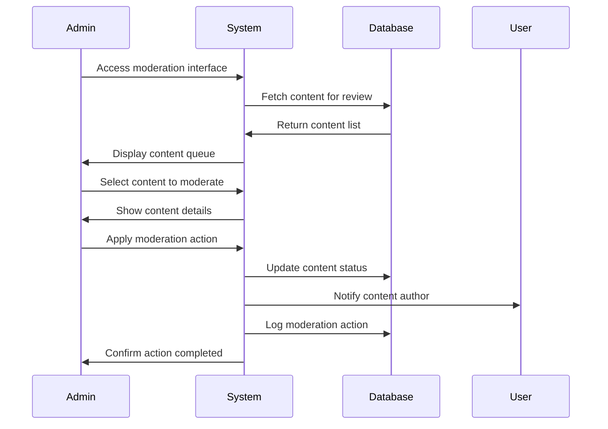
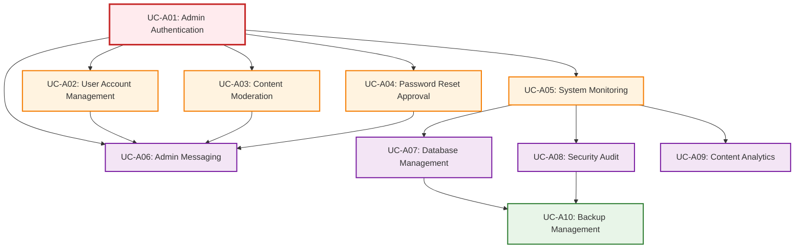

# Admin Use Cases - TechForum

## Overview
This document describes all use cases for administrators of the TechForum platform, covering system administration, user management, and content moderation.

## 🎯 Purpose
- Define administrative interactions with the system
- Specify security and management requirements
- Guide administrative interface implementation

---

## 🔐 Actor: Administrator

### 📋 Use Case Summary

| Use Case ID | Use Case Name | Priority | Complexity |
|-------------|---------------|----------|------------|
| UC-A01 | Admin Authentication | Critical | High |
| UC-A02 | User Account Management | High | Medium |
| UC-A03 | Content Moderation | High | Medium |
| UC-A04 | Password Reset Approval | High | Medium |
| UC-A05 | System Monitoring | High | High |
| UC-A06 | Admin Messaging | Medium | Medium |
| UC-A07 | Database Management | Medium | High |
| UC-A08 | Security Audit | Medium | High |
| UC-A09 | Content Analytics | Medium | Medium |
| UC-A10 | Backup Management | Low | High |

---

## 📝 Detailed Use Cases

### UC-A01: Admin Authentication

**Description:** Administrator gains secure access to the admin panel through two-layer authentication

**Actor:** Administrator

**Preconditions:**
- Administrator has valid admin credentials
- Admin access tokens are configured
- System is operational

**Main Flow:**
1. Admin navigates to auth.php
2. Admin clicks "Admin Access" button
3. System redirects to admin_access.php
4. System displays token entry form
5. Admin enters security token
6. System validates token
7. System displays credential entry form
8. Admin enters username and password
9. System validates admin credentials
10. System creates admin session
11. System redirects to admin dashboard
12. System logs admin access

**Alternative Flows:**
- **A1:** Invalid security token
  - System displays "access denied" message
  - System logs unauthorized access attempt
  - Admin cannot proceed to credential form
- **A2:** Invalid admin credentials
  - System displays login error
  - System logs failed login attempt
  - Admin can retry with correct credentials
- **A3:** Multiple failed attempts
  - System implements temporary lockout
  - System alerts security monitoring
  - Admin must wait before retry

**Postconditions:**
- Admin session is established with elevated privileges
- Admin access is logged for audit purposes
- Admin gains access to management interface

**Business Rules:**
- Two-layer authentication is mandatory
- All admin actions are logged
- Session timeout is shorter than regular users
- Failed attempts trigger security alerts

---

### UC-A02: User Account Management

**Description:** Administrator manages user accounts including activation, deactivation, and profile modifications

**Actor:** Administrator

**Preconditions:**
- Admin is authenticated with elevated privileges
- User accounts exist in the system

**Main Flow:**
1. Admin accesses admin dashboard
2. Admin navigates to user management section
3. System displays user listing with search/filter options
4. Admin selects user account to manage
5. System displays user details and available actions
6. Admin performs desired action (activate/deactivate/modify)
7. System prompts for confirmation
8. Admin confirms action
9. System executes user account changes
10. System logs administrative action
11. System displays operation result

**Alternative Flows:**
- **A1:** User account not found
  - System displays "user not found" error
  - Admin returns to user listing
- **A2:** Action conflicts with system rules
  - System displays conflict explanation
  - Admin can override or choose different action
- **A3:** User has active sessions
  - System warns about session termination
  - Admin can proceed or defer action

**Postconditions:**
- User account status is updated
- Administrative action is logged
- Affected user is notified (if applicable)

**Business Rules:**
- All user management actions are logged
- Users are notified of account status changes
- Critical account changes require confirmation
- Admin cannot delete own account

---

### UC-A03: Content Moderation

**Description:** Administrator reviews, moderates, and manages forum content

**Actor:** Administrator

**Preconditions:**
- Admin is authenticated
- Content exists in the system
- Moderation queue may contain reported items

**Main Flow:**
1. Admin accesses content moderation interface
2. System displays content requiring review
3. Admin reviews post/reply content
4. Admin evaluates content against community guidelines
5. Admin selects moderation action (approve/delete/flag)
6. System prompts for moderation reason
7. Admin provides reason and confirms action
8. System executes moderation action
9. System updates content status
10. System notifies content author (if applicable)
11. System logs moderation decision

**Alternative Flows:**
- **A1:** No content requires moderation
  - System displays "no pending items" message
  - Admin can browse all content for proactive moderation
- **A2:** Content author contests moderation
  - System creates moderation appeal
  - Admin reviews appeal and makes final decision
- **A3:** Content violates multiple policies
  - Admin can apply multiple flags/actions
  - System escalates to higher-level review

**Postconditions:**
- Content moderation status is updated
- Author is notified of moderation action
- Moderation decision is logged for audit

**Business Rules:**
- All moderation actions require justification
- Authors can appeal moderation decisions
- Deleted content is soft-deleted for review
- Moderation logs are permanent

---

### UC-A04: Password Reset Approval

**Description:** Administrator reviews and processes user password reset requests

**Actor:** Administrator

**Preconditions:**
- Admin is authenticated
- Password reset requests exist in the system
- Users have submitted valid reset requests

**Main Flow:**
1. Admin accesses password reset management
2. System displays pending reset requests
3. Admin reviews request details (user, email, timestamp)
4. Admin verifies user identity and legitimacy
5. Admin selects approval or rejection
6. System prompts for admin response/reason
7. Admin provides response and confirms decision
8. For approvals: System generates temporary password
9. System updates request status
10. System notifies user through platform messaging
11. System logs admin decision

**Alternative Flows:**
- **A1:** Request appears fraudulent
  - Admin rejects request with detailed reason
  - System flags user account for review
  - User is notified of rejection
- **A2:** User account has security concerns
  - Admin can require additional verification
  - Admin can place account on hold
  - Request is deferred pending investigation

**Postconditions:**
- Reset request status is updated
- User receives notification of decision
- Temporary password is generated (if approved)
- Admin decision is logged

**Business Rules:**
- All reset decisions require admin justification
- Temporary passwords expire after first use
- Users can appeal rejected requests
- Security concerns trigger additional review

---

### UC-A05: System Monitoring

**Description:** Administrator monitors system health, performance, and security metrics

**Actor:** Administrator

**Preconditions:**
- Admin is authenticated
- System monitoring tools are operational
- Performance data is being collected

**Main Flow:**
1. Admin accesses system monitoring dashboard
2. System displays real-time metrics
3. Admin reviews performance indicators
4. Admin checks security alerts and logs
5. Admin examines user activity patterns
6. Admin identifies potential issues
7. Admin takes corrective action if needed
8. System logs monitoring session

**Performance Metrics Monitored:**
- **System Health:**
  - Server response times
  - Database performance
  - Error rates
  - Resource utilization

- **Security Metrics:**
  - Login attempts and failures
  - Suspicious access patterns
  - Admin access logs
  - Security alert notifications

- **User Activity:**
  - Registration trends
  - Post creation rates
  - User engagement metrics
  - Content quality indicators

**Alternative Flows:**
- **A1:** Critical system alert detected
  - System immediately notifies admin
  - Admin investigates and responds
  - Emergency procedures may be activated
- **A2:** Performance degradation identified
  - Admin investigates root cause
  - Admin implements optimization measures
  - System performance is restored

**Postconditions:**
- System health is assessed
- Issues are identified and addressed
- Monitoring data is archived
- Performance baselines are updated

**Business Rules:**
- Monitoring is continuous and automated
- Critical alerts require immediate response
- Performance data is retained for trend analysis
- Security incidents trigger investigation protocols

---

### UC-A06: Admin Messaging

**Description:** Administrator sends messages to users through the platform messaging system

**Actor:** Administrator

**Preconditions:**
- Admin is authenticated
- Target users exist in the system
- Messaging system is operational

**Main Flow:**
1. Admin accesses messaging interface
2. Admin selects target user(s) or broadcasts
3. Admin composes message content
4. Admin previews message formatting
5. Admin confirms message send
6. System delivers message to recipients
7. System logs message in admin communications
8. System tracks message delivery status

**Message Types:**
- **Individual Messages:** Direct communication to specific users
- **Broadcast Messages:** System-wide announcements
- **Group Messages:** Messages to user segments
- **Automated Messages:** Template-based notifications

**Alternative Flows:**
- **A1:** User account not found
  - System displays error and suggests alternatives
  - Admin can verify user information
- **A2:** Message violates communication policies
  - System warns admin about policy conflicts
  - Admin can modify message or override
- **A3:** Bulk messaging limits exceeded
  - System implements rate limiting
  - Admin can schedule message for later delivery

**Postconditions:**
- Messages are delivered to recipients
- Message history is maintained
- Delivery status is tracked
- Communication is logged for audit

**Business Rules:**
- All admin messages are logged
- Users cannot reply to system messages
- Message content is subject to audit
- Broadcasting requires elevated permissions

---

### UC-A07: Database Management

**Description:** Administrator performs database maintenance, migrations, and schema updates

**Actor:** System Administrator

**Preconditions:**
- Admin has database management privileges
- Database is accessible and operational
- Backup procedures are in place

**Main Flow:**
1. Admin accesses database management tools
2. Admin reviews database status and health
3. Admin selects maintenance operation
4. System prompts for operation confirmation
5. Admin confirms database operation
6. System executes database commands
7. System provides operation results
8. Admin verifies operation success
9. System logs database changes

**Database Operations:**
- **Schema Migrations:** Adding/modifying table structures
- **Data Cleanup:** Removing obsolete or corrupted data
- **Index Optimization:** Improving query performance
- **Backup Management:** Creating and restoring backups

**Alternative Flows:**
- **A1:** Database operation fails
  - System rolls back partial changes
  - Admin investigates error cause
  - Admin retries with corrected parameters
- **A2:** Operation requires system downtime
  - Admin schedules maintenance window
  - Users are notified of planned downtime
  - System enters maintenance mode

**Postconditions:**
- Database operation is completed
- System performance may be improved
- Changes are logged and documented
- Data integrity is verified

**Business Rules:**
- Critical operations require backup
- Schema changes are versioned
- Operations are logged for audit
- Rollback procedures must be available

---

### UC-A08: Security Audit

**Description:** Administrator conducts security reviews and implements security measures

**Actor:** Security Administrator

**Preconditions:**
- Admin has security audit permissions
- Audit tools and logs are available
- Security policies are defined

**Main Flow:**
1. Admin initiates security audit
2. System gathers security-related data
3. Admin reviews access logs and patterns
4. Admin analyzes security vulnerabilities
5. Admin identifies potential threats
6. Admin implements security improvements
7. System updates security configurations
8. Admin documents audit findings
9. System schedules next audit cycle

**Security Areas Reviewed:**
- **Access Control:** User permissions and admin access
- **Authentication:** Login security and session management
- **Data Protection:** Encryption and data handling
- **Network Security:** Server configuration and vulnerabilities

**Alternative Flows:**
- **A1:** Security breach detected
  - Admin triggers incident response protocol
  - System implements emergency security measures
  - Affected users are notified
- **A2:** Compliance violations identified
  - Admin creates remediation plan
  - System implements corrective measures
  - Compliance status is updated

**Postconditions:**
- Security status is assessed
- Vulnerabilities are addressed
- Security measures are enhanced
- Audit report is generated

**Business Rules:**
- Security audits are conducted regularly
- Critical vulnerabilities require immediate action
- Audit results are documented and retained
- Compliance requirements must be maintained

---

### UC-A09: Content Analytics

**Description:** Administrator analyzes content performance and engagement metrics

**Actor:** Administrator

**Preconditions:**
- Admin is authenticated
- Content data and metrics are available
- Analytics tools are operational

**Main Flow:**
1. Admin accesses analytics dashboard
2. Admin selects analysis parameters (date range, content type)
3. System generates content performance reports
4. Admin reviews engagement metrics
5. Admin identifies trends and patterns
6. Admin creates content strategy recommendations
7. System exports analysis results
8. Admin shares insights with stakeholders

**Analytics Metrics:**
- **Content Performance:**
  - Post view counts and engagement
  - Reply rates and discussion quality
  - Category performance analysis
  - Content lifecycle metrics

- **User Engagement:**
  - User activity patterns
  - Content creation trends
  - Community participation rates
  - User retention metrics

**Alternative Flows:**
- **A1:** Insufficient data for analysis
  - System suggests longer analysis period
  - Admin adjusts parameters or waits for more data
- **A2:** Performance anomalies detected
  - Admin investigates unusual patterns
  - System provides drill-down analysis
  - Admin implements corrective measures

**Postconditions:**
- Content performance is analyzed
- Trends and insights are identified
- Strategic recommendations are generated
- Analysis results are documented

**Business Rules:**
- Analytics respect user privacy
- Data is aggregated and anonymized where appropriate
- Reports are generated regularly
- Insights guide platform improvements

---

### UC-A10: Backup Management

**Description:** Administrator manages system backups and disaster recovery procedures

**Actor:** System Administrator

**Preconditions:**
- Admin has backup management privileges
- Backup systems are configured
- Storage resources are available

**Main Flow:**
1. Admin accesses backup management interface
2. Admin reviews current backup status
3. Admin initiates backup operation (if needed)
4. System performs data backup procedures
5. Admin verifies backup completion
6. Admin tests backup integrity
7. System updates backup inventory
8. Admin schedules next backup cycle

**Backup Types:**
- **Database Backups:** Complete database snapshots
- **File System Backups:** Application and user files
- **Configuration Backups:** System settings and configurations
- **Incremental Backups:** Changes since last full backup

**Alternative Flows:**
- **A1:** Backup operation fails
  - System alerts admin to failure
  - Admin investigates and resolves issues
  - Admin retries backup operation
- **A2:** Storage capacity exceeded
  - Admin implements cleanup procedures
  - Admin archives older backups
  - Admin expands storage capacity

**Postconditions:**
- System data is backed up securely
- Backup integrity is verified
- Recovery procedures are tested
- Backup schedule is maintained

**Business Rules:**
- Backups are performed regularly
- Multiple backup versions are retained
- Backups are stored securely
- Recovery procedures are documented and tested

---

## 🔄 Admin Use Case Relationships

## 📊 Administrative Metrics

### Priority Distribution
- **Critical:** 1 use case (10%) - Authentication (system access)
- **High Priority:** 4 use cases (40%) - Core admin functions
- **Medium Priority:** 4 use cases (40%) - Management features
- **Low Priority:** 1 use case (10%) - Maintenance functions

### Security Levels
- **System Admin:** Full access to all use cases
- **Content Admin:** UC-A03, UC-A06, UC-A09
- **User Admin:** UC-A02, UC-A04, UC-A06
- **Security Admin:** UC-A01, UC-A05, UC-A08

---
*These use cases define the complete administrative interface and security model for TechForum.*