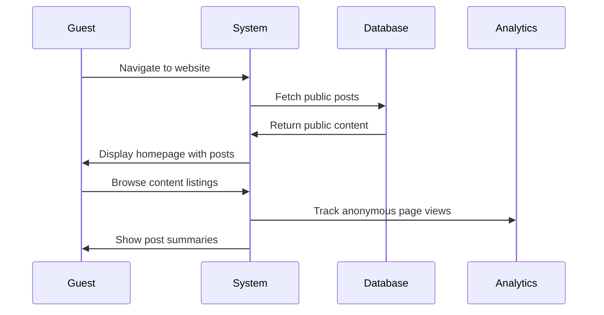
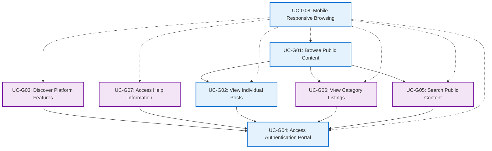

# Guest Use Cases - TechForum

## Overview
This document describes all use cases for guest (unauthenticated) users of the TechForum platform, covering public browsing and system discovery functionality.

## 🎯 Purpose
- Define guest interactions with the system
- Specify public access functionality
- Guide public interface implementation
- Support user acquisition and engagement

---

## 👥 Actor: Guest User

### 📋 Use Case Summary

| Use Case ID | Use Case Name | Priority | Complexity |
|-------------|---------------|----------|------------|
| UC-G01 | Browse Public Content | High | Low |
| UC-G02 | View Individual Posts | High | Low |
| UC-G03 | Discover Platform Features | Medium | Low |
| UC-G04 | Access Authentication Portal | High | Low |
| UC-G05 | Search Public Content | Medium | Medium |
| UC-G06 | View Category Listings | Medium | Low |
| UC-G07 | Access Help Information | Medium | Low |
| UC-G08 | Mobile Responsive Browsing | High | Medium |

---

## 📝 Detailed Use Cases

### UC-G01: Browse Public Content

**Description:** Guest user explores publicly available forum content without authentication

**Actor:** Guest User

**Preconditions:**
- TechForum platform is accessible
- Public content exists in the system
- No authentication required

**Main Flow:**
1. Guest navigates to TechForum website (index.php)
2. System displays homepage with latest posts
3. Guest browses post listings with metadata
4. System shows post titles, authors, creation dates, categories
5. Guest can view post summaries and engagement metrics
6. Guest navigates between different content sections
7. System tracks anonymous page views for analytics

**Alternative Flows:**
- **A1:** No public content available
  - System displays welcome message
  - System provides information about platform purpose
  - System encourages user registration
- **A2:** Platform is in maintenance mode
  - System displays maintenance notice
  - System provides expected return time
  - Guest can check back later

**Postconditions:**
- Guest has viewed public content
- Anonymous analytics are recorded
- Guest may be motivated to register

**Business Rules:**
- Only public, non-deleted content is visible
- User-specific information is not displayed
- Anonymous browsing is always permitted
- Content previews are limited to encourage registration

---

### UC-G02: View Individual Posts

**Description:** Guest user reads complete individual posts and their replies

**Actor:** Guest User

**Preconditions:**
- Guest is browsing public content
- Valid post exists and is public
- Post has not been deleted or restricted

**Main Flow:**
1. Guest clicks on post title from listing
2. System navigates to post.php?id=X
3. System verifies post is publicly accessible
4. System displays complete post content
5. System shows post metadata (author, date, category, views)
6. System displays public replies to the post
7. System increments anonymous view counter
8. Guest reads post and replies content

**Alternative Flows:**
- **A1:** Post is private or deleted
  - System displays "post not found" or "access denied"
  - System redirects to public post listings
  - Guest cannot access restricted content
- **A2:** Post has no replies
  - System displays post content only
  - System shows "no replies yet" message
  - System may suggest related content

**Postconditions:**
- Post view count is incremented
- Guest has accessed complete post content
- Anonymous engagement is tracked
- Guest may discover more content or register

**Business Rules:**
- View counts include anonymous visitors
- Only public posts and replies are displayed
- User identification information may be limited
- Registration prompts are contextually displayed

---

### UC-G03: Discover Platform Features

**Description:** Guest user explores platform capabilities and learns about registration benefits

**Actor:** Guest User

**Preconditions:**
- Guest is browsing the platform
- Feature discovery elements are available
- Information architecture supports exploration

**Main Flow:**
1. Guest notices registration/login prompts
2. Guest explores about.php or help sections
3. System displays platform features and benefits
4. Guest learns about discussion capabilities
5. Guest views community guidelines
6. Guest understands registration process
7. System highlights member benefits
8. Guest may proceed to registration

**Feature Discovery Areas:**
- **Platform Overview:**
  - Discussion forum capabilities
  - Category-based organization
  - Community features
  - User interaction benefits

- **Registration Benefits:**
  - Ability to create posts
  - Participate in discussions
  - Profile customization
  - Community engagement

**Alternative Flows:**
- **A1:** Guest wants immediate access
  - System displays registration form
  - Guest can create account without browsing
- **A2:** Guest needs more information
  - System provides detailed FAQ
  - Guest can explore community examples
  - System offers guided tour

**Postconditions:**
- Guest understands platform value proposition
- Guest has discovered registration benefits
- Guest may be motivated to create account
- Platform engagement is increased

**Business Rules:**
- Feature discovery is non-intrusive
- Registration benefits are clearly explained
- Community value is demonstrated
- User privacy is respected during discovery

---

### UC-G04: Access Authentication Portal

**Description:** Guest user accesses login/registration interface to create account or sign in

**Actor:** Guest User

**Preconditions:**
- Guest wants to access member features
- Authentication system is operational
- Registration is open to new users

**Main Flow:**
1. Guest clicks login/register links or buttons
2. System navigates to auth.php
3. System displays authentication portal with:
   - Login form for existing users
   - Registration form for new users
   - Animated toggle between forms
4. Guest chooses login or registration
5. System provides appropriate form
6. Guest may complete authentication process
7. System handles authentication result

**Authentication Portal Features:**
- **Visual Design:**
  - Animated form transitions
  - Professional styling
  - Mobile-responsive layout
  - Clear call-to-action buttons

- **Functionality:**
  - Dual-purpose login/registration
  - Password reset access
  - Form validation
  - Error handling

**Alternative Flows:**
- **A1:** Guest chooses registration
  - Flow continues to user registration use case
  - New account creation process begins
- **A2:** Guest chooses login
  - Flow continues to user authentication
  - Existing account access is provided
- **A3:** Guest cancels authentication
  - System returns to previous page
  - Guest continues anonymous browsing

**Postconditions:**
- Guest has accessed authentication interface
- Guest can proceed with account creation or login
- User experience is optimized for conversion
- Guest remains engaged with platform

**Business Rules:**
- Authentication portal is always accessible
- Forms include proper validation
- User experience is optimized
- Security measures are implemented

---

### UC-G05: Search Public Content

**Description:** Guest user searches through publicly available content using keywords or filters

**Actor:** Guest User

**Preconditions:**
- Search functionality is available to guests
- Public content exists for searching
- Search index is maintained

**Main Flow:**
1. Guest accesses search interface
2. Guest enters search keywords
3. System processes search query
4. System searches public content only
5. System returns filtered results
6. Guest browses search results
7. Guest can refine search criteria
8. System tracks search analytics

**Search Capabilities:**
- **Content Types:**
  - Post titles and content
  - Public replies
  - Category information
  - User-generated tags

- **Search Filters:**
  - Date ranges
  - Categories
  - Content type
  - Popularity metrics

**Alternative Flows:**
- **A1:** No search results found
  - System displays "no results" message
  - System suggests alternative search terms
  - System shows popular content instead
- **A2:** Search query too broad
  - System provides filtering options
  - System suggests refinement
  - System shows most relevant results

**Postconditions:**
- Guest has found relevant content
- Search behavior is analyzed
- Content discoverability is improved
- Guest engagement may increase

**Business Rules:**
- Search includes public content only
- Results respect privacy settings
- Search analytics improve system
- Performance is optimized for guest use

---

### UC-G06: View Category Listings

**Description:** Guest user browses content organized by categories

**Actor:** Guest User

**Preconditions:**
- Categories are defined in the system
- Public posts are assigned to categories
- Category navigation is available

**Main Flow:**
1. Guest accesses category navigation
2. System displays available categories
3. Guest selects category of interest
4. System filters content by selected category
5. System displays category-specific posts
6. Guest browses category content
7. Guest can switch between categories
8. System tracks category preferences

**Available Categories:**
- **Soft Skills:** Professional development discussions
- **Technology:** Technical topics and innovations
- **Academics:** Educational content and resources
- **Sports:** Athletic activities and discussions
- **Lifestyle:** General life topics and interests

**Alternative Flows:**
- **A1:** Category has no public content
  - System displays "no posts in category" message
  - System suggests other active categories
  - System may show sample content
- **A2:** Guest wants all categories
  - System provides "all categories" view
  - System displays mixed content from all categories
  - Guest can filter as needed

**Postconditions:**
- Guest has explored category-organized content
- Content discovery is enhanced
- User preferences are understood
- Category engagement is tracked

**Business Rules:**
- Categories organize content logically
- Category filtering preserves public access
- Navigation is intuitive and responsive
- Content quality is maintained across categories

---

### UC-G07: Access Help Information

**Description:** Guest user accesses platform help, guidelines, and documentation

**Actor:** Guest User

**Preconditions:**
- Help documentation is available
- Information is maintained and current
- Multiple help topics are covered

**Main Flow:**
1. Guest accesses help or about section
2. System displays help navigation
3. Guest selects help topic of interest
4. System shows relevant documentation
5. Guest reads help content
6. Guest can navigate between help topics
7. System provides contact information if needed
8. Guest may proceed to registration after learning

**Help Content Areas:**
- **Platform Overview:**
  - How TechForum works
  - Community guidelines
  - Discussion best practices
  - Member benefits

- **Getting Started:**
  - Registration process
  - Creating first post
  - Navigating the interface
  - Community participation

**Alternative Flows:**
- **A1:** Guest needs specific assistance
  - System provides contact information
  - System offers community support options
  - Guest can ask questions through available channels
- **A2:** Help content is insufficient
  - System provides feedback mechanism
  - Guest can suggest improvements
  - System tracks help effectiveness

**Postconditions:**
- Guest has accessed helpful information
- Guest understands platform better
- Community guidelines are communicated
- Support needs are identified

**Business Rules:**
- Help content is publicly accessible
- Information is accurate and current
- Multiple support channels are available
- User feedback improves documentation

---

### UC-G08: Mobile Responsive Browsing

**Description:** Guest user accesses platform through mobile devices with optimized experience

**Actor:** Guest User (Mobile)

**Preconditions:**
- Guest is using mobile device
- Platform is mobile-responsive
- Mobile-optimized features are available

**Main Flow:**
1. Guest navigates to platform on mobile device
2. System detects mobile browser
3. System delivers mobile-optimized interface
4. Guest browses content with touch navigation
5. System adapts layout for screen size
6. Guest can perform all public actions on mobile
7. System maintains performance on mobile networks
8. Guest has equivalent experience to desktop

**Mobile Optimizations:**
- **Interface Design:**
  - Touch-friendly navigation
  - Optimized typography
  - Compressed images
  - Streamlined layouts

- **Performance:**
  - Fast loading times
  - Efficient data usage
  - Offline capability (basic)
  - Progressive loading

**Alternative Flows:**
- **A1:** Slow mobile connection
  - System provides lightweight interface
  - System offers text-only options
  - Content loads progressively
- **A2:** Small screen device
  - System maximizes content area
  - System simplifies navigation
  - Essential features remain accessible

**Postconditions:**
- Guest has optimal mobile experience
- Platform accessibility is maximized
- Mobile engagement is supported
- Cross-device consistency is maintained

**Business Rules:**
- Mobile experience equals desktop functionality
- Performance is optimized for mobile
- Touch interactions are intuitive
- Responsive design is maintained

---

## 🔄 Guest Use Case Relationships

## 📊 Guest Experience Metrics

### Conversion Funnel
1. **Discovery:** Guest finds platform (UC-G01)
2. **Engagement:** Guest explores content (UC-G02, UC-G06)
3. **Interest:** Guest discovers features (UC-G03, UC-G07)
4. **Conversion:** Guest registers (UC-G04)

### Priority Distribution
- **High Priority:** 4 use cases (50%) - Core guest functionality
- **Medium Priority:** 4 use cases (50%) - Enhanced discovery features

### Accessibility Requirements
- **Mobile Support:** All use cases must work on mobile devices
- **Performance:** Fast loading for guest retention
- **SEO Optimization:** Public content discoverable by search engines
- **Progressive Enhancement:** Core functionality without JavaScript

---

## 🎯 Guest Experience Goals

### Primary Objectives
- **Content Discovery:** Help guests find valuable content
- **Value Demonstration:** Show platform benefits clearly
- **Conversion Support:** Guide guests toward registration
- **Performance:** Ensure fast, responsive experience

### Success Metrics
- **Engagement Rate:** Time spent browsing content
- **Conversion Rate:** Guest-to-user registration percentage
- **Content Interaction:** Posts viewed, categories explored
- **Mobile Usage:** Mobile device engagement levels

### User Journey Optimization
- **Entry Points:** Multiple paths to discover content
- **Content Quality:** High-value public content visible
- **Call-to-Action:** Clear registration incentives
- **User Experience:** Seamless transition to member features

---
*These use cases ensure that TechForum provides an excellent guest experience that encourages user registration and community participation.*