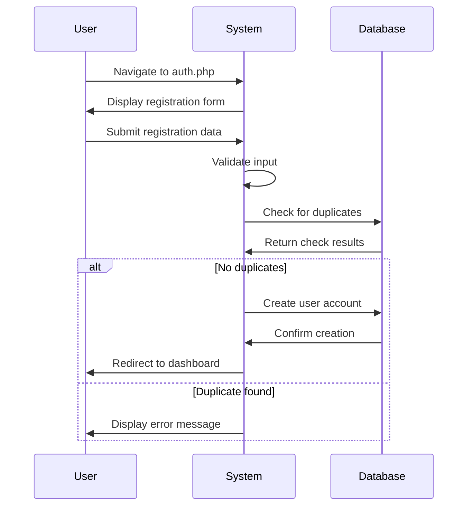
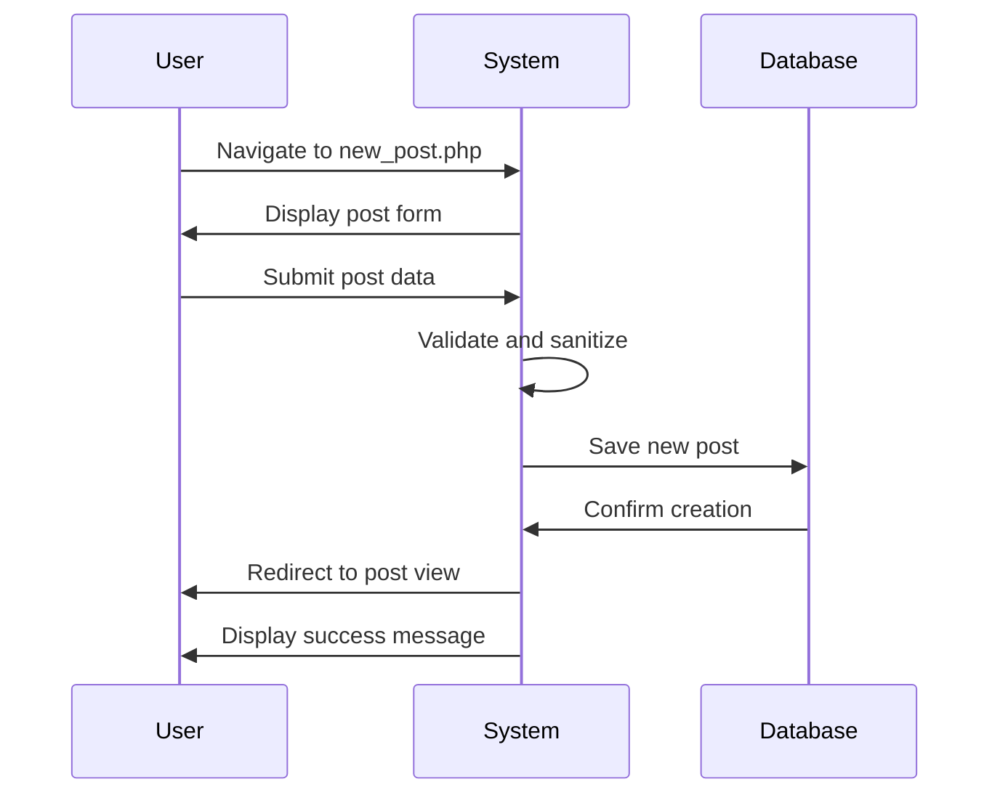
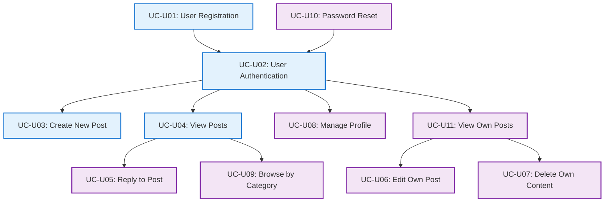

# User Use Cases - TechForum

## Overview
This document describes all use cases for regular users of the TechForum platform, covering registration through content management and profile administration.

## 🎯 Purpose
- Define user interactions with the system
- Specify functional requirements
- Guide implementation and testing

---

## 👤 Actor: Registered User

### 📋 Use Case Summary

| Use Case ID | Use Case Name | Priority | Complexity |
|-------------|---------------|----------|------------|
| UC-U01 | User Registration | High | Medium |
| UC-U02 | User Authentication | High | Medium |
| UC-U03 | Create New Post | High | Medium |
| UC-U04 | View Posts | High | Low |
| UC-U05 | Reply to Post | High | Medium |
| UC-U06 | Edit Own Post | Medium | Medium |
| UC-U07 | Delete Own Content | Medium | Medium |
| UC-U08 | Manage Profile | Medium | Low |
| UC-U09 | Browse by Category | Medium | Low |
| UC-U10 | Search Content | Low | High |
| UC-U11 | Password Reset | Medium | High |
| UC-U12 | View Own Posts | Medium | Low |

---

## 📝 Detailed Use Cases

### UC-U01: User Registration

**Description:** New user creates an account on TechForum

**Actor:** Unregistered User

**Preconditions:**
- User has access to the TechForum website
- User does not have an existing account

**Main Flow:**
1. User navigates to auth.php
2. User clicks "Sign Up" toggle
3. System displays registration form
4. User enters username, email, and password
5. User submits registration form
6. System validates input data
7. System checks for duplicate username/email
8. System creates new user account
9. System redirects user to dashboard
10. System displays welcome message

**Alternative Flows:**
- **A1:** Username already exists
  - System displays error message
  - User modifies username and resubmits
- **A2:** Email already registered
  - System displays error message with login suggestion
  - User can proceed to login
- **A3:** Invalid password (too short)
  - System displays password requirements
  - User enters stronger password

**Postconditions:**
- User account is created in database
- User is automatically logged in
- User session is established

**Business Rules:**
- Username must be 3-20 characters, alphanumeric + underscore/dash
- Email must be valid format and unique
- Password must be at least 6 characters
- All fields are required

---

### UC-U02: User Authentication

**Description:** Registered user logs into their account

**Actor:** Registered User

**Preconditions:**
- User has a valid TechForum account
- User is not currently logged in

**Main Flow:**
1. User navigates to auth.php
2. System displays login form
3. User enters email and password
4. User submits login form
5. System validates credentials
6. System creates user session
7. System redirects to dashboard
8. System displays personalized content

**Alternative Flows:**
- **A1:** Invalid credentials
  - System displays error message
  - User can retry login or reset password
- **A2:** Account disabled
  - System displays account status message
  - User is advised to contact admin

**Postconditions:**
- User session is established
- User gains access to protected features
- User activity is tracked

**Business Rules:**
- Login attempts may be rate-limited
- Sessions expire after inactivity
- Password is never stored in plain text

---

### UC-U03: Create New Post

**Description:** User creates a new discussion post

**Actor:** Registered User

**Preconditions:**
- User is logged in
- User has posting privileges

**Main Flow:**
1. User navigates to new_post.php
2. System displays post creation form
3. User enters post title
4. User enters post content
5. User selects category
6. User submits post
7. System validates post data
8. System saves post to database
9. System redirects to post view
10. System displays success message

**Alternative Flows:**
- **A1:** Missing required fields
  - System highlights missing fields
  - User completes required information
- **A2:** Content violates policies
  - System displays policy violation notice
  - User modifies content

**Postconditions:**
- New post is created in database
- Post appears in public listings
- Post is associated with user account

**Business Rules:**
- Title and content are required
- Content is sanitized before storage
- Posts are assigned to valid categories
- Creation timestamp is recorded

---

### UC-U04: View Posts

**Description:** User browses and reads forum posts

**Actor:** Registered User or Guest

**Preconditions:**
- User has access to the forum

**Main Flow:**
1. User navigates to posts.php or index.php
2. System retrieves post listings
3. System displays posts with metadata
4. User clicks on a post title
5. System navigates to post.php?id=X
6. System increments view count
7. System displays full post content
8. System shows existing replies
9. User reads content

**Alternative Flows:**
- **A1:** No posts available
  - System displays "no posts" message
  - System provides link to create first post
- **A2:** Post has been deleted
  - System displays "post not found" message
  - System redirects to posts listing

**Postconditions:**
- Post view count is incremented
- User reading activity is tracked
- Related content may be suggested

**Business Rules:**
- View counts are throttled per session
- Deleted posts are hidden from normal users
- Posts display creation date and author

---

### UC-U05: Reply to Post

**Description:** User adds a reply to an existing post

**Actor:** Registered User

**Preconditions:**
- User is logged in
- User is viewing a valid post
- Post allows replies

**Main Flow:**
1. User views post on post.php?id=X
2. System displays reply form at bottom
3. User enters reply content
4. User submits reply
5. System validates reply data
6. System saves reply to database
7. System refreshes page
8. System displays new reply

**Alternative Flows:**
- **A1:** Empty reply content
  - System displays validation error
  - User enters content and resubmits
- **A2:** Post is locked/deleted
  - System disables reply form
  - System displays status message

**Postconditions:**
- Reply is saved to database
- Reply appears under the post
- Reply is associated with user and post

**Business Rules:**
- Reply content is required
- Replies are threaded under posts
- Reply timestamps are recorded
- Content is sanitized before storage

---

### UC-U06: Edit Own Post

**Description:** User modifies their own existing post

**Actor:** Registered User

**Preconditions:**
- User is logged in
- User owns the post to be edited
- Post is not deleted

**Main Flow:**
1. User navigates to their post
2. User clicks "Edit" button
3. System navigates to edit_post.php?id=X
4. System verifies ownership
5. System displays edit form with current content
6. User modifies title/content/category
7. User submits changes
8. System validates updated data
9. System saves changes to database
10. System redirects to updated post

**Alternative Flows:**
- **A1:** User doesn't own post
  - System displays "permission denied" error
  - System redirects to post view
- **A2:** Post has been deleted
  - System displays "post not found" error
  - System redirects to posts listing

**Postconditions:**
- Post content is updated in database
- Edit timestamp is recorded
- Updated post is displayed

**Business Rules:**
- Only post owner can edit their posts
- Admins can edit any post
- Edit history may be maintained
- Updated timestamp is recorded

---

### UC-U07: Delete Own Content

**Description:** User soft-deletes their own posts or replies

**Actor:** Registered User

**Preconditions:**
- User is logged in
- User owns the content to be deleted

**Main Flow:**
1. User navigates to their content
2. User clicks "Delete" button
3. System prompts for confirmation
4. User confirms deletion
5. System verifies ownership
6. System marks content as deleted
7. System updates deletion timestamp
8. System redirects to appropriate listing
9. System displays confirmation message

**Alternative Flows:**
- **A1:** User cancels deletion
  - System returns to content view
  - No changes are made
- **A2:** Content already deleted
  - System displays status message
  - No further action taken

**Postconditions:**
- Content is marked as deleted
- Content is hidden from public view
- Deletion is recorded in database

**Business Rules:**
- Deletion is soft delete (data preserved)
- Only owners can delete their content
- Deleted content can be restored by admin
- Associated replies may also be affected

---

### UC-U08: Manage Profile

**Description:** User updates their account profile information

**Actor:** Registered User

**Preconditions:**
- User is logged in
- User has access to profile page

**Main Flow:**
1. User navigates to profile.php
2. System displays current profile information
3. User modifies editable fields
4. User submits profile updates
5. System validates new information
6. System saves changes to database
7. System displays success confirmation
8. System shows updated profile

**Alternative Flows:**
- **A1:** Invalid email format
  - System displays validation error
  - User corrects email and resubmits
- **A2:** Username already taken
  - System displays error message
  - User chooses different username

**Postconditions:**
- Profile information is updated
- Changes are reflected across the system
- Update timestamp is recorded

**Business Rules:**
- Email must remain unique
- Username changes affect all content attribution
- Some fields may be restricted from editing
- Profile updates are logged

---

### UC-U09: Browse by Category

**Description:** User filters posts by category

**Actor:** Registered User or Guest

**Preconditions:**
- Categories are defined in the system
- Posts are assigned to categories

**Main Flow:**
1. User views posts listing
2. User selects category filter
3. System filters posts by selected category
4. System displays filtered results
5. User browses category-specific posts

**Alternative Flows:**
- **A1:** No posts in selected category
  - System displays "no posts" message
  - System suggests other categories
- **A2:** Category doesn't exist
  - System redirects to all posts
  - System displays error message

**Postconditions:**
- User sees posts from selected category only
- Category filter remains active during session
- User can easily switch between categories

**Business Rules:**
- Available categories: Soft Skills, Technology, Academics, Sports, Lifestyle
- Posts must have valid category assignment
- Category filter persists during browsing session

---

### UC-U10: Password Reset

**Description:** User resets forgotten password through admin approval

**Actor:** Registered User

**Preconditions:**
- User has forgotten their password
- User has access to their registered email

**Main Flow:**
1. User clicks "Forgot Password" on login form
2. System displays password reset information
3. User clicks link to password reset page
4. User enters registered email address
5. User submits reset request
6. System validates email address
7. System creates reset request for admin review
8. System displays submission confirmation
9. Admin reviews and approves request
10. System generates temporary password
11. User receives new credentials through platform
12. User logs in with temporary password

**Alternative Flows:**
- **A1:** Email not found
  - System displays "email not found" message
  - User can retry with different email
- **A2:** Reset request denied
  - System notifies user of denial
  - User can contact admin directly

**Postconditions:**
- Password reset request is recorded
- New temporary password is generated (if approved)
- User can log in with new credentials

**Business Rules:**
- Reset requests require admin approval
- Temporary passwords expire after first use
- Multiple reset requests may be limited
- Email validation is required

---

### UC-U11: View Own Posts

**Description:** User views and manages their own posts

**Actor:** Registered User

**Preconditions:**
- User is logged in
- User has created posts

**Main Flow:**
1. User navigates to posts.php?view=my
2. System filters posts by current user
3. System displays user's posts with management options
4. User can edit, delete, or view individual posts
5. System provides post statistics (views, replies)

**Alternative Flows:**
- **A1:** User has no posts
  - System displays "no posts yet" message
  - System provides link to create first post

**Postconditions:**
- User sees only their own content
- Management options are available
- Post statistics are displayed

**Business Rules:**
- Only user's own posts are shown
- Edit/delete options are available for each post
- Post metrics are displayed (views, reply count)
- Deleted posts may be shown with special indicator

---

## 🔄 Use Case Relationships

## 📊 Use Case Metrics

### Priority Distribution
- **High Priority:** 4 use cases (33%) - Core functionality
- **Medium Priority:** 7 use cases (58%) - Important features  
- **Low Priority:** 1 use case (8%) - Enhancement features

### Complexity Analysis
- **Low Complexity:** 4 use cases - Simple CRUD operations
- **Medium Complexity:** 7 use cases - Business logic integration
- **High Complexity:** 1 use case - Multi-step workflows

---
*These use cases define the complete user interaction model for TechForum.*